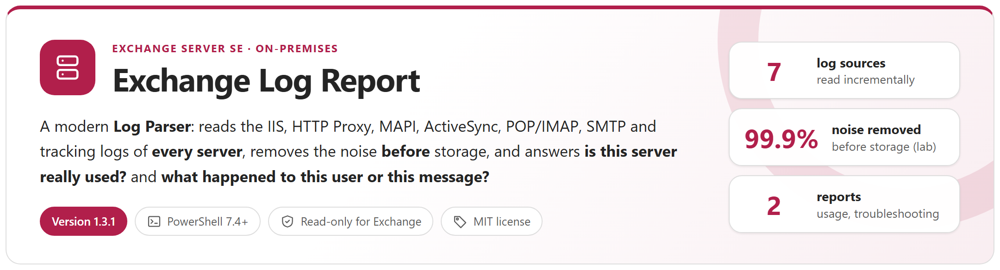
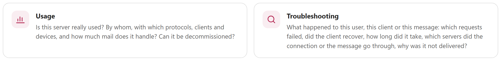
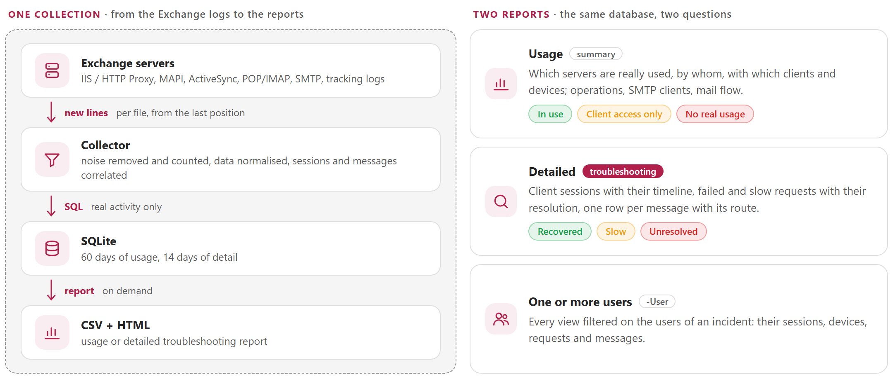
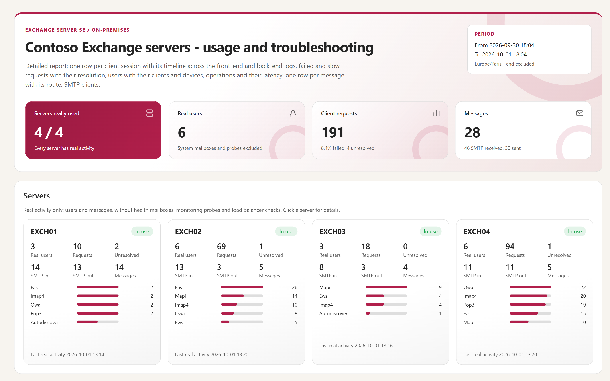
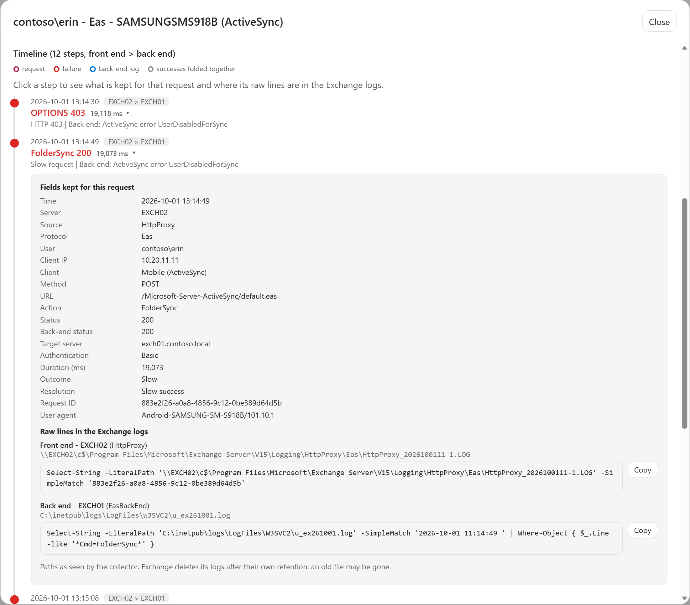
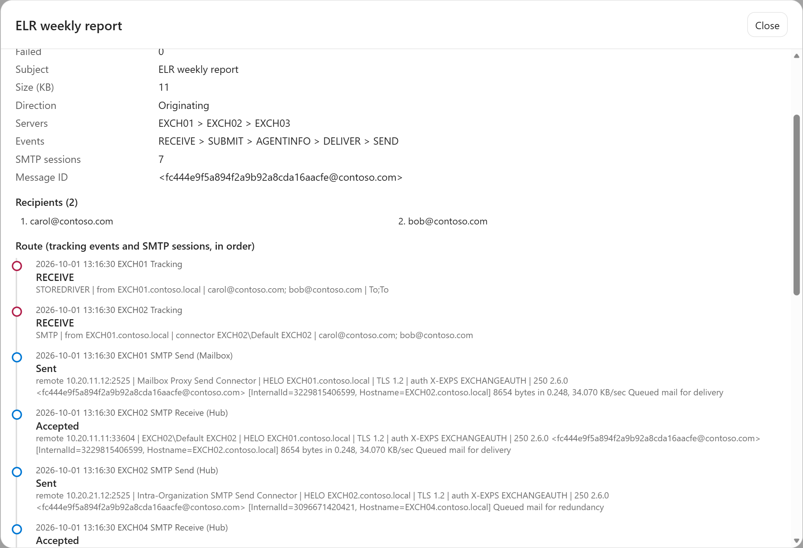

<p align="center">
  <picture>
    <source media="(prefers-color-scheme: dark)" srcset="docs/images/readme-banner-dark.png">
    
  </picture>
</p>

<p align="center">
  <a href="#how-it-works"><b>How it works</b></a> &nbsp;&middot;&nbsp;
  <a href="#noise-removed-before-storage"><b>Noise removed</b></a> &nbsp;&middot;&nbsp;
  <a href="#sessions-and-messages"><b>Sessions and messages</b></a> &nbsp;&middot;&nbsp;
  <a href="#reports"><b>Reports</b></a> &nbsp;&middot;&nbsp;
  <a href="#quick-start"><b>Quick start</b></a> &nbsp;&middot;&nbsp;
  <a href="docs/ExchangeLogReport-Guide.md"><b>Administrator guide</b></a>
</p>

> [!IMPORTANT]
> Files downloaded from the Internet may be blocked by Windows and fail to run. Before using this project, unblock every file in the downloaded folder:
>
> ```powershell
> Get-ChildItem "C:\Chemin\Du\Dossier" -Recurse -File -Force | Unblock-File
> ```
>
> Replace the example path with the folder where you downloaded or extracted this project.

## Why

Exchange writes gigabytes of logs per day and per server, and almost none of it is user activity: Managed Availability probes, health mailboxes, load balancer checks, anonymous authentication challenges, SMTP connections without any message. Yet two questions come back all the time, and they used to need Log Parser queries on raw files, server by server. This tool answers both, for several servers at once.

<picture>
  <source media="(prefers-color-scheme: dark)" srcset="docs/images/readme-why-dark.png">
  
</picture>

## How it works

<picture>
  <source media="(prefers-color-scheme: dark)" srcset="docs/images/readme-how-dark.png">
  
</picture>

- **Nothing to install on Exchange.** One collector — an Exchange server running the tool as SYSTEM, or an administration server — reads the log folders of every server over the administrative shares, every hour, and only the **new lines** of each file.
- **The real log folders, checked at every run.** `-Mode Discover` asks Exchange where each server really writes its logs — Exchange on another drive, SMTP logs moved per role, message tracking, POP/IMAP — and reads the IIS sites from `applicationHost.config`, including a second OWA/ECP site. Every collection then follows a moved IIS log folder and warns when an expected folder is missing or a source has stopped writing.
- **One entry point, one configuration file.** `Invoke-ExchangeLogReport.ps1` finds the log folders (`-Mode Discover`), collects (`-Mode Collect`), builds a report (`-Range`, `-ReportType`, `-User`, `-Server`) or shows what the database holds (`-Mode Status`).
- **Read-only** for Exchange: the tool only reads log files and settings (`Get-*` cmdlets, IIS configuration), never changes a setting and never sends anything; the reports stay on the local disk.

## Noise removed before storage

<picture>
  <source media="(prefers-color-scheme: dark)" srcset="docs/images/readme-noise-dark.png">
  
</picture>

> [!TIP]
> **A first failure is not a problem.** The anonymous `401` of the first Autodiscover or Outlook request is a normal authentication step, never counted as a failure. A real failure followed by a success of the same user is **Recovered**; only what stayed broken is **Unresolved**.

The 1–3 GB of logs per day and server of a production environment never reach the database as such: it grows with the number of real users and messages, not with the log volume.

## Sessions and messages

<picture>
  <source media="(prefers-color-scheme: dark)" srcset="docs/images/readme-sessions-dark.png">
  
</picture>

- **One row per client session** — Outlook (MAPI), ActiveSync device, OWA, EWS, IMAP/POP client — with the result hidden behind HTTP 200 in the back end (MAPI status, `DeviceNotProvisioned`, `UserDisabledForSync`), the wrong passwords seen by IIS, slow requests, latencies, user agents and devices. Each step of the timeline shows the log files and a ready-to-copy command that finds the raw lines.
- **One row per message**, received or sent, with its status and its full route behind a click, plus the mail refused during the SMTP conversation. **SMTP clients** lists the applications, devices and servers that still send mail through the servers.

## Reports

Six tabs — **Client sessions**, **Failed and slow requests**, **Users**, **Operations**, **Messages**, **SMTP clients** — with search, filters, sortable columns and export, up to hundreds of thousands of rows. Every report also writes complete CSV files. Click a screenshot to open it at full size.

**Overview** · which servers are really used, by whom, with which protocols

<a href="docs/images/readme-report-overview.png?raw=true"></a>

**Client session** · the timeline across the front-end and back-end logs; a step shows the fields kept and where its raw lines are

<a href="docs/images/readme-report-session.png?raw=true"></a>

<details>
<summary><b>Message</b> · recipients, route across the servers and SMTP transcripts</summary>
<br>
<a href="docs/images/readme-report-message.png?raw=true"></a>
</details>

<details>
<summary><b>SMTP client</b> · the applications and devices that send mail, each transaction with its SMTP transcript</summary>
<br>
<a href="docs/images/readme-report-smtp-client.png?raw=true"></a>
</details>

<details>
<summary><b>Console</b> · title card, numbered steps, summary card with the report folder</summary>
<br>
<a href="docs/images/readme-console-report.png?raw=true"></a>
</details>

## Requirements

| Item | Requirement |
|---|---|
| Exchange | Exchange Server SE, on-premises |
| PowerShell | 7.4 or later — a portable zip is enough. `-Mode Discover` runs the Exchange cmdlets in Windows PowerShell 5.1 (built into Windows Server), since they are not supported in PowerShell 7 |
| Account | Local administrator of every Exchange server, to read the log folders over the administrative shares. On an Exchange server: SYSTEM (member of *Exchange Trusted Subsystem*), nothing to configure. On an administration server: a domain account, with *Log on as a batch job* on that server ([guide, 4.1](docs/ExchangeLogReport-Guide.md#41-where-to-run-it-and-with-which-account)) |
| Exchange role | *View-Only Organization Management*, for `-Mode Discover` only — the collection reads files and needs no Exchange role |
| Network | SMB (445) from the collector to every server; from an administration server, also HTTP (80) to one Exchange server for `-Mode Discover` (remote PowerShell, Kerberos) |
| Logging | SMTP protocol logging `Verbose` on the connectors to analyse; POP/IMAP protocol logs optional. HTTP Proxy, IIS, MAPI and message tracking logs are on by default |
| SQLite | Bundled in `lib\sqlite` — nothing to install |

## Quick start

```powershell
git clone https://github.com/Nico77600/ExchangeLogReport.git
cd ExchangeLogReport
notepad .\config\ExchangeLogReport.config.psd1            # list the Exchange servers (names only)

.\Invoke-ExchangeLogReport.ps1 -Mode Status               # checks the configuration
.\Invoke-ExchangeLogReport.ps1 -Mode Discover             # real log folders of every server (View-Only Organization Management)
.\Invoke-ExchangeLogReport.ps1 -Mode Collect              # first collection, then every hour (scheduled task)
.\Invoke-ExchangeLogReport.ps1 -Range Last30Days          # usage: which servers are really used, by whom
.\Invoke-ExchangeLogReport.ps1 -Range Last24Hours -ReportType Detailed -User alice@contoso.com
```

The database keeps 60 days of usage and 14 days of detail (client sessions, failed and slow requests, SMTP transcripts). The zip of each [release](https://github.com/Nico77600/ExchangeLogReport/releases) contains only the files needed to run; `.\tools\New-ExchangeLogReportPackage.ps1` builds the same package from the repository.

## Documentation

The **administrator guide** covers the principles, where to run the tool and with which account, installation, configuration (servers and log folders found by `-Mode Discover`, sources, noise rules, slow-request threshold, retention), the scheduled collection, how to read each tab of the report, the correlation rules, the data model, volumes, troubleshooting and how to modify the tool:

- [docs/ExchangeLogReport-Guide.md](docs/ExchangeLogReport-Guide.md)
- `docs/ExchangeLogReport-Guide.html` — the same guide as a single HTML file, with a light and a dark theme (download it and open it locally)

## Tests

```powershell
Invoke-Pester -Path .\tests      # Pester 5+, logs generated in the exact Exchange formats, no Exchange server needed
```

The tool was also validated on a lab of four Exchange Server SE servers (two sites, one DAG) with generated traffic: Outlook, iPhone and Android ActiveSync, OWA, EWS, Outlook for Mac, IMAP, POP, SMTP submission and relay, wrong passwords, blocked devices; and with a collector on an administration server, log folders moved to another drive and a second OWA/ECP web site (guide, chapter 14).

## License

[MIT](LICENSE). The bundled SQLite components keep their own licenses: see [THIRD-PARTY-NOTICES.md](THIRD-PARTY-NOTICES.md).

## Disclaimer

Personal project, provided as is. It is not an official Microsoft product and is not supported by Microsoft. Test it in your environment before production use.
