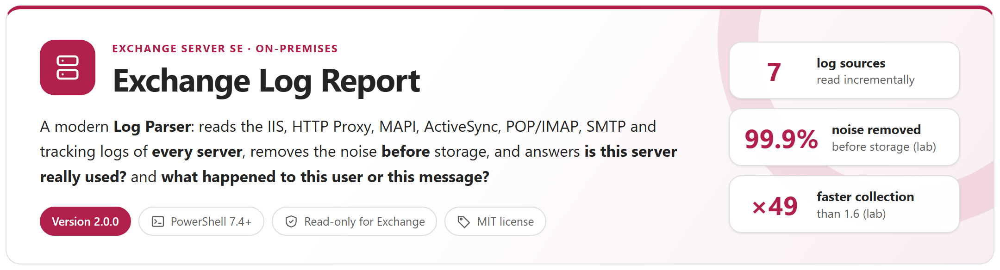
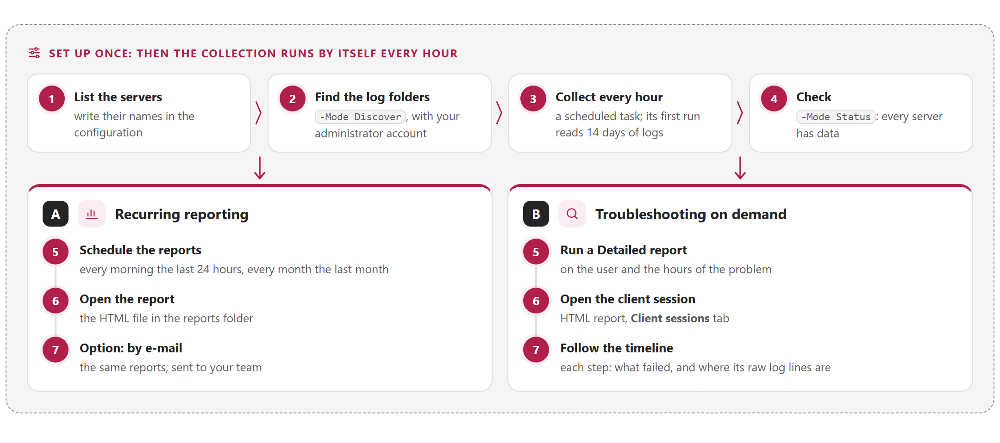
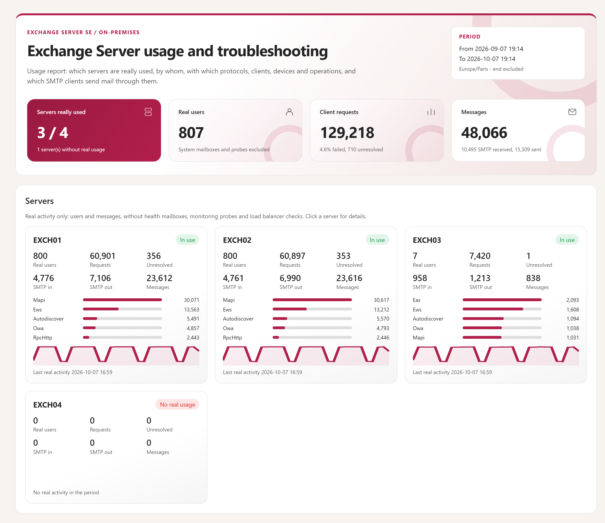
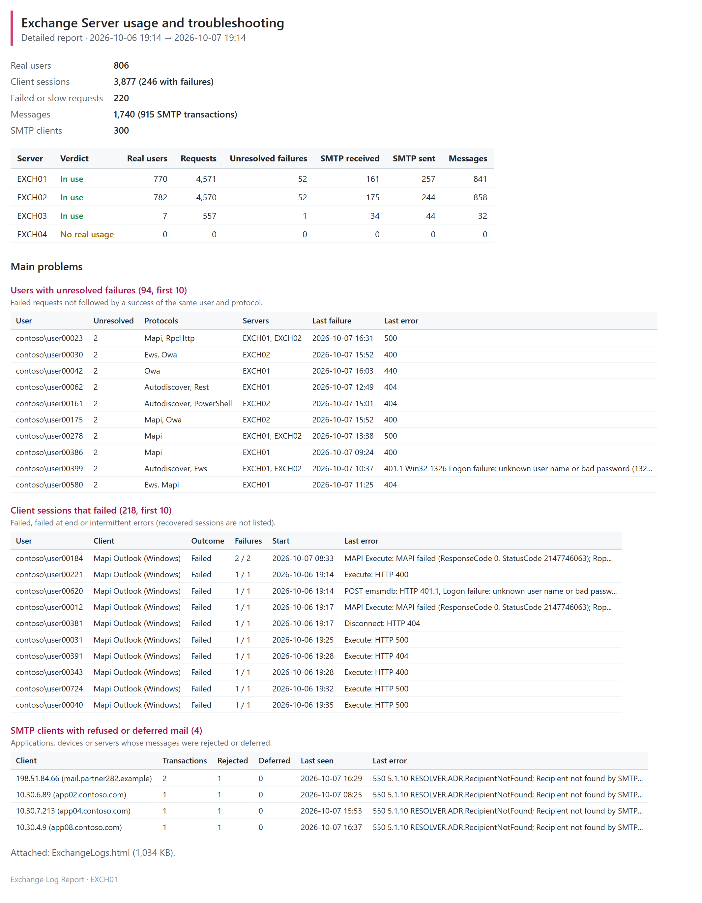
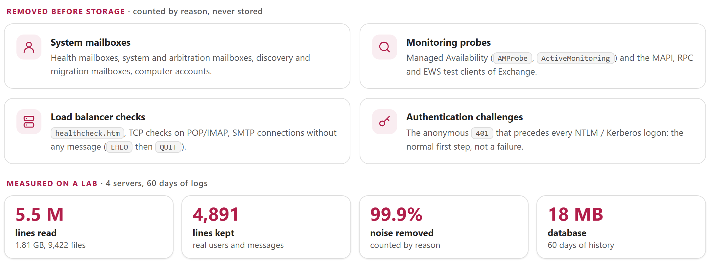
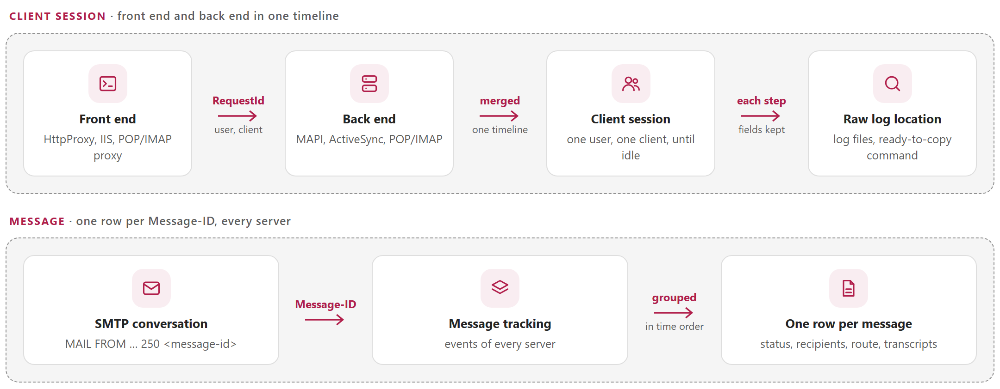
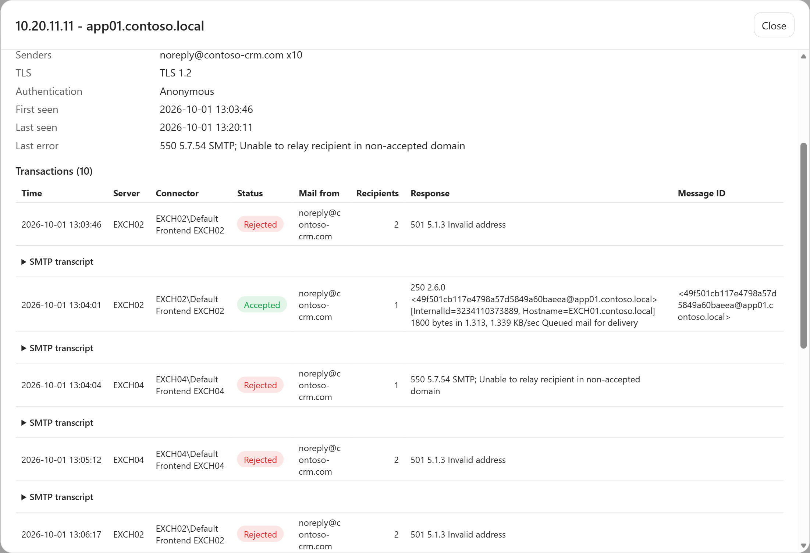
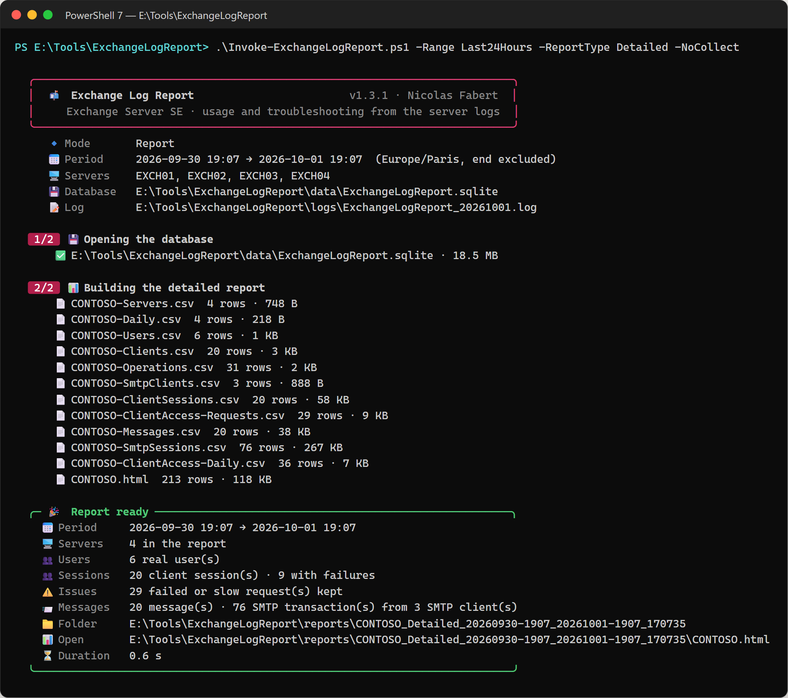

<p align="center">
  <picture>
    <source media="(prefers-color-scheme: dark)" srcset="package/docs/images/readme-banner-dark.png">
    
  </picture>
</p>

<p align="center">
  <a href="#get-started"><b>Get started</b></a> &nbsp;&middot;&nbsp;
  <a href="#how-it-works"><b>How it works</b></a> &nbsp;&middot;&nbsp;
  <a href="#noise-removed-before-storage"><b>Noise removed</b></a> &nbsp;&middot;&nbsp;
  <a href="#sessions-and-messages"><b>Sessions and messages</b></a> &nbsp;&middot;&nbsp;
  <a href="#reports"><b>Reports</b></a> &nbsp;&middot;&nbsp;
  <a href="package/docs/ExchangeLogReport-UserGuide.md"><b>User guide</b></a> &nbsp;&middot;&nbsp;
  <a href="package/docs/ExchangeLogReport-Guide.md"><b>Developer guide</b></a>
</p>

> [!IMPORTANT]
> Files downloaded from the Internet may be blocked by Windows and fail to run. Before using this project, unblock every file in the downloaded folder:
>
> ```powershell
> Get-ChildItem "C:\Chemin\Du\Dossier" -Recurse -File -Force | Unblock-File
> ```
>
> Replace the example path with the folder where you downloaded or extracted this project.

## Why

Exchange writes gigabytes of logs per day and per server, and almost none of it is user activity: Managed Availability probes, health mailboxes, load balancer checks, anonymous authentication challenges, SMTP connections without any message. Yet two questions come back all the time, and they used to need Log Parser queries on raw files, server by server. This tool answers both, for several servers at once.

<picture>
  <source media="(prefers-color-scheme: dark)" srcset="package/docs/images/readme-why-dark.png">
  
</picture>

## Get started

<picture>
  <source media="(prefers-color-scheme: dark)" srcset="package/docs/images/readme-path-dark.png">
  
</picture>

One path for everyone. Set the tool up once (**1 to 4**), then take branch **A** to have reports made for you every day and every month, branch **B** to investigate a problem, or both. **A · Recurring reporting** is for the messaging manager, the architects and operations: which servers can go, which old clients and applications remain, what keeps failing — without anyone running a command; the reports are HTML files, and can be sent by e-mail too. **B · Troubleshooting** is for the Exchange administrators and support: a user, a message or an incident answered in minutes.

The commands use one example — servers `EXCH01` to `EXCH04`, the tool in `E:\Tools\ExchangeLogReport` on EXCH01 run as SYSTEM, `contoso.com`, `alice`. Copy them as they are and only change these names to yours; the [user guide](package/docs/ExchangeLogReport-UserGuide.md) explains each step, what you should see and what to do if not.

### Set up once · 1 to 4

```powershell
# On EXCH01, in PowerShell 7 as administrator, in the folder of the tool
# Use the zip of the latest release, or copy the repository package folder.
cd E:\Tools\ExchangeLogReport

# 1 · List the servers: one @{ Name = 'EXCH01' } line per server, in Servers
notepad .\config\ExchangeLogReport.config.psd1

# 2 · Find the log folders, with your administrator account (not as SYSTEM)
.\Invoke-ExchangeLogReport.ps1 -Mode Discover

# 3 · Collect every hour, as SYSTEM; the first run, now, reads 14 days of logs
$pwsh = 'E:\Tools\pwsh\pwsh.exe'
$tool = 'E:\Tools\ExchangeLogReport\Invoke-ExchangeLogReport.ps1'
$run  = "$pwsh -NoProfile -ExecutionPolicy Bypass -File $tool"
schtasks /Create /F /RU SYSTEM /RL HIGHEST /TN "Exchange Log Report - collect" `
    /SC HOURLY /TR "$run -Mode Collect"
schtasks /Run /TN "Exchange Log Report - collect"

# 4 · Check, once the first run is over: every server and every source has data
.\Invoke-ExchangeLogReport.ps1 -Mode Status
```

### A · Recurring reporting · 5 to 7

```powershell
# 5 · Schedule the reports: every day at 07:00 the last 24 hours,
#     the 1st of every month the last month; then the daily one, now
$pwsh = 'E:\Tools\pwsh\pwsh.exe'
$tool = 'E:\Tools\ExchangeLogReport\Invoke-ExchangeLogReport.ps1'
$run  = "$pwsh -NoProfile -ExecutionPolicy Bypass -File $tool"
schtasks /Create /F /RU SYSTEM /RL HIGHEST /TN "Exchange Log Report - daily report" `
    /SC DAILY /ST 07:00 /TR "$run -Range Last24Hours -ReportType Detailed"
schtasks /Create /F /RU SYSTEM /RL HIGHEST /TN "Exchange Log Report - monthly report" `
    /SC MONTHLY /D 1 /ST 07:00 /TR "$run -Range PreviousMonth"
schtasks /Run /TN "Exchange Log Report - daily report"

# 6 · Open the newest report: an HTML file, it works offline and can be sent as is
Get-ChildItem .\reports -Recurse -Filter ExchangeLogs.html |
    Sort-Object LastWriteTime | Select-Object -Last 1 | Invoke-Item

# 7 · Option: by e-mail too. In the Mail section: SmtpServer = 'mail.contoso.com',
#     Port = 25, Encryption = 'StartTls', Authentication = 'Anonymous',
#     To = @('messaging-team@contoso.com'). Send a test message, then create
#     the two tasks of step 5 again with -SendMail at the end of /TR
notepad .\config\ExchangeLogReport.config.psd1
.\Invoke-ExchangeLogReport.ps1 -Mode MailTest
```

<details>
<summary><b>What you get every month</b> · the usage of every server: EXCH04 used by nobody, EXCH03 by 7 users and a scanner only — the people to contact before it goes</summary>
<br>
<a href="package/docs/images/readme-report-overview.png?raw=true"></a>
</details>

<details>
<summary><b>With the e-mail option, every morning</b> · the main problems of the last 24 hours in the body, the report attached</summary>
<br>
<a href="package/docs/images/readme-mail-daily.png?raw=true"></a>
</details>

### B · Troubleshooting · 5 to 7

```powershell
# 5 · Alice says that Outlook and her phone kept failing this morning:
#     a Detailed report on her, on that period
.\Invoke-ExchangeLogReport.ps1 -ReportType Detailed -User alice@contoso.com `
    -Start '2026-10-07 08:00' -End '2026-10-07 12:00'

# 6 · Open the HTML file shown at the end, tab Client sessions,
#     and click the session that failed
# 7 · Follow the timeline: each step shows what failed, front end and back end,
#     and the command that finds its raw log lines
```

<details>
<summary><b>What you see</b> · the timeline of the session, front end and back end; a step shows its fields and where its raw lines are</summary>
<br>
<a href="package/docs/images/readme-report-session.png?raw=true"></a>
</details>

A message that did not arrive (`-User bob@contoso.com`, tab **Messages**) or an incident on some servers (`-Server EXCH01, EXCH02`, tab **Failed and slow requests**) follow the same three steps: [user guide, chapter 5](package/docs/ExchangeLogReport-UserGuide.md#5-b--troubleshooting).

Reports read the database: they take seconds to minutes, never wait for the collection, and read the new log lines first only when the last collection is older than 90 minutes. The database keeps 60 days of usage and 14 days of detail (client sessions, failed and slow requests, SMTP transcripts).

## How it works

<picture>
  <source media="(prefers-color-scheme: dark)" srcset="package/docs/images/readme-how-dark.png">
  
</picture>

- **Nothing to install on Exchange.** One collector — an Exchange server running the tool as SYSTEM, or an administration server — reads the log folders of every server over the administrative shares, every hour, and only the **new lines** of each file.
- **Fast, even on months of logs.** Every server and every source is read at the same time, and a single thread writes the database in large transactions. On the same lab collector and the same 14 days of logs of two servers (14.6 GB), 2.0.0 collects in **6 minutes** where 1.6 took **4 h 56 min**, and a 30-day usage report takes 2 min 30 s instead of 15 minutes. The hourly collection reads one hour of logs: a few seconds per server.
- **The real log folders, checked at every run.** `-Mode Discover` asks Exchange where each server really writes its logs — Exchange on another drive, SMTP logs moved per role, message tracking, POP/IMAP — and reads the IIS sites from `applicationHost.config`, including a second OWA/ECP site. Every collection then follows a moved IIS log folder and warns when an expected folder is missing or a source has stopped writing.
- **One entry point, one configuration file.** `Invoke-ExchangeLogReport.ps1` finds the log folders (`-Mode Discover`), collects (`-Mode Collect`), builds a report from the database (`-Range`, `-Date`, `-Month`, `-Start` / `-End`, `-ReportType`, `-User`, `-Server`), sends it by e-mail (`-SendMail`, `-Mode MailTest`) or shows what the database holds (`-Mode Status`). No parameter is ignored silently: a period that contradicts another is an error, and a parameter that the mode does not use is shown with the reason.
- **Edge Transport servers too.** Run on the Edge itself, the tool reads only its SMTP protocol logs and message tracking, and builds an **Edge report**: messages, SMTP clients (who sends to the Edge) and SMTP destinations (Exchange Online, internet MX, the mailbox servers).
- **Read-only** for Exchange: the tool only reads log files and settings (`Get-*` cmdlets, IIS configuration) and never changes a setting. The reports stay on the local disk, unless the `Mail` section sends them by e-mail: anonymous, Basic or Kerberos (GSSAPI) authentication, STARTTLS or TLS.

## Noise removed before storage

<picture>
  <source media="(prefers-color-scheme: dark)" srcset="package/docs/images/readme-noise-dark.png">
  
</picture>

> [!TIP]
> **A first failure is not a problem.** The anonymous `401` of the first Autodiscover or Outlook request is a normal authentication step, never counted as a failure. A real failure followed by a success of the same user is **Recovered**; only what stayed broken is **Unresolved**.

The 1–3 GB of logs per day and server of a production environment never reach the database as such: it grows with the number of real users and messages, not with the log volume.

## Sessions and messages

<picture>
  <source media="(prefers-color-scheme: dark)" srcset="package/docs/images/readme-sessions-dark.png">
  
</picture>

- **One row per client session** — Outlook (MAPI), ActiveSync device, OWA, EWS, IMAP/POP client — with the result hidden behind HTTP 200 in the back end (MAPI status, `DeviceNotProvisioned`, `UserDisabledForSync`), the wrong passwords seen by IIS, slow requests, latencies, user agents and devices. Each step of the timeline shows the log files and a ready-to-copy command that finds the raw lines.
- **One row per message**, received or sent, with its status and its full route behind a click, plus the mail refused during the SMTP conversation. **SMTP clients** lists the applications, devices and servers that still send mail through the servers.

## Reports

Six tabs — **Client sessions**, **Failed and slow requests**, **Users**, **Operations**, **Messages**, **SMTP clients** — with search, filters, sortable columns and export, up to hundreds of thousands of rows. On an Edge Transport server, the report shows the mail flow only: **Messages**, **SMTP clients** and **SMTP destinations**. Every report also writes complete CSV files. Click a screenshot to open it at full size.

**Overview** · which servers are really used, by whom, with which protocols

<a href="package/docs/images/readme-report-overview.png?raw=true"></a>

**Client session** · the timeline across the front-end and back-end logs; a step shows the fields kept and where its raw lines are

<a href="package/docs/images/readme-report-session.png?raw=true"></a>

<details>
<summary><b>Message</b> · recipients, route across the servers and SMTP transcripts</summary>
<br>
<a href="package/docs/images/readme-report-message.png?raw=true"></a>
</details>

<details>
<summary><b>SMTP client</b> · the applications and devices that send mail, each transaction with its SMTP transcript</summary>
<br>
<a href="package/docs/images/readme-report-smtp-client.png?raw=true"></a>
</details>

<details>
<summary><b>Console</b> · title card, numbered steps, summary card with the report folder</summary>
<br>
<a href="package/docs/images/readme-console-report.png?raw=true"></a>
</details>

## Requirements

| Item | Requirement |
|---|---|
| Exchange | Exchange Server SE, on-premises |
| PowerShell | 7.4 or later — a portable zip is enough. `-Mode Discover` runs the Exchange cmdlets in Windows PowerShell 5.1 (built into Windows Server), since they are not supported in PowerShell 7 |
| Account | Local administrator of every Exchange server, to read the log folders over the administrative shares. On an Exchange server: SYSTEM (member of *Exchange Trusted Subsystem*), nothing to configure. On an administration server: a domain account, with *Log on as a batch job* on that server ([developer guide, 4.1](package/docs/ExchangeLogReport-Guide.md#41-where-to-run-it-and-with-which-account)) |
| Exchange role | *View-Only Organization Management*, for `-Mode Discover` only — the collection reads files and needs no Exchange role |
| Network | SMB (445) from the collector to every server; from an administration server, also HTTP (80) to one Exchange server for `-Mode Discover` (remote PowerShell, Kerberos) |
| Logging | SMTP protocol logging `Verbose` on the connectors to analyse; POP/IMAP protocol logs optional. HTTP Proxy, IIS, MAPI and message tracking logs are on by default |
| Edge Transport | Its own copy of the tool on the Edge itself, as SYSTEM or a local administrator |
| E-mail (optional) | SMTP (25, 587 or 465) from the collector to a receive connector that accepts it: anonymous, Basic or Kerberos |
| SQLite | Bundled in `lib\sqlite` — nothing to install |

## Documentation

The `package` folder of this repository holds exactly the files needed to run Exchange Log Report, with both guides. The zip of each [release](https://github.com/Nico77600/ExchangeLogReport/releases) contains the same run-time files with the HTML guides; `.\tools\New-ExchangeLogReportPackage.ps1` builds that zip content from the repository.

| Guide | Content |
|---|---|
| **[User guide](package/docs/ExchangeLogReport-UserGuide.md)** | **The guided path**, step by step: set up once (**1 to 4**), then **A · Recurring reporting** (scheduled HTML reports, e-mail as an option) or **B · Troubleshooting** (a user, a message, an incident). Each step gives the command to copy, what you should see and what to do if not; then how to keep it running and how to change the examples. |
| **[Developer guide](package/docs/ExchangeLogReport-Guide.md)** | Everything else: the principles, where to run the tool and with which account, installation, configuration (servers and log folders found by `-Mode Discover`, sources, noise rules, slow-request threshold, retention), the scheduled collection and reports, the e-mail settings, how to read each tab of the report, the correlation rules, the data model, volumes and performance, troubleshooting, how to modify and validate the tool. |

Both guides also exist as a single HTML file with a light and a dark theme (`package/docs/ExchangeLogReport-UserGuide.html`, `package/docs/ExchangeLogReport-Guide.html`): download them and open them locally, or use the copies in the release zip.

## Tests

```powershell
Invoke-Pester -Path .\tests      # Pester 5+, logs generated in the exact Exchange formats, no Exchange server needed
```

`tools\New-ExlSyntheticLogs.ps1` writes logs with the volumes of a production server (or a decommissioning case), and `tools\Measure-ExlCollection.ps1` measures a collection on them: the performance figures above come from these tools, on a PC and on the lab ([developer guide, chapter 12](package/docs/ExchangeLogReport-Guide.md#12-volumes-and-performance)).

The tool was also validated on a lab of four Exchange Server SE servers (two sites, one DAG) and an Edge Transport server with generated traffic: Outlook, iPhone and Android ActiveSync, OWA, EWS, Outlook for Mac, IMAP, POP, SMTP submission and relay, wrong passwords, blocked devices, internet mail through the Edge; and with a collector on an administration server, log folders moved to another drive and a second OWA/ECP web site (developer guide, chapter 14).

## License

[MIT](LICENSE). The bundled SQLite components keep their own licenses: see [THIRD-PARTY-NOTICES.md](package/THIRD-PARTY-NOTICES.md).

## Disclaimer

Personal project, provided as is. It is not an official Microsoft product and is not supported by Microsoft. Test it in your environment before production use.
