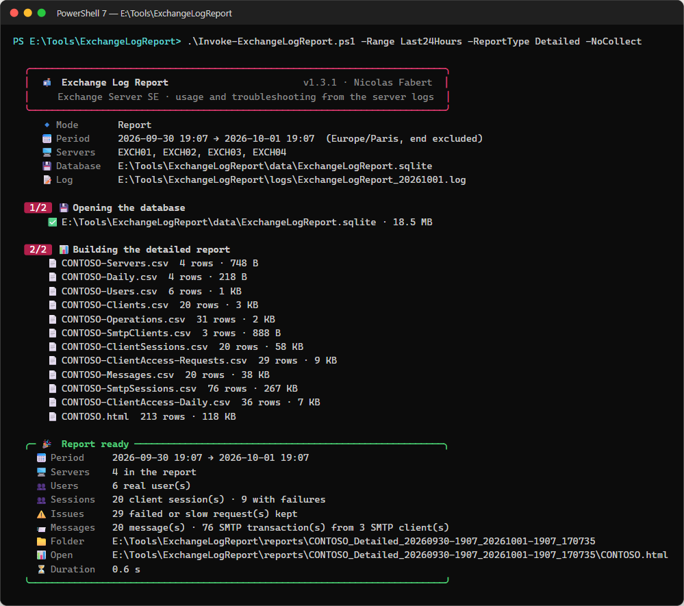
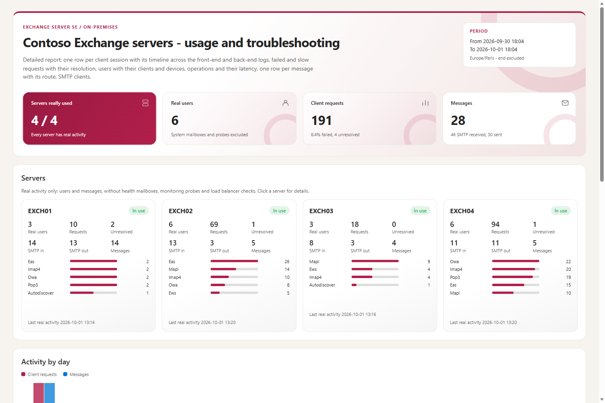
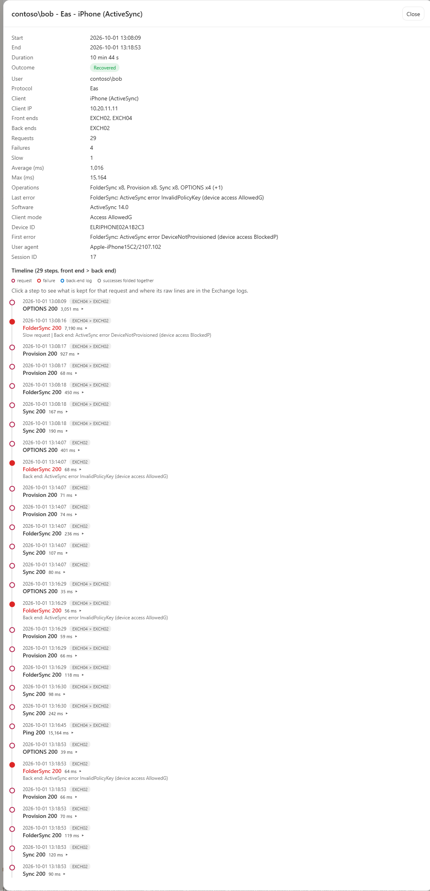
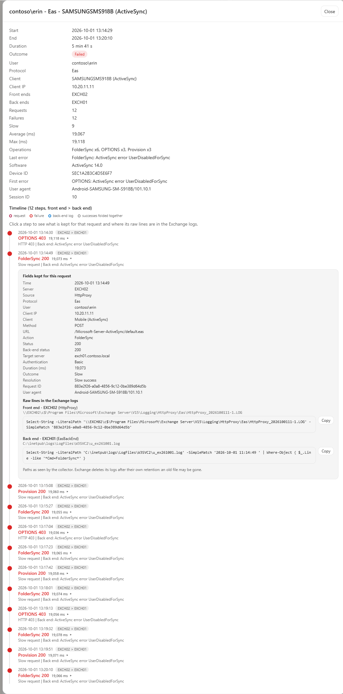
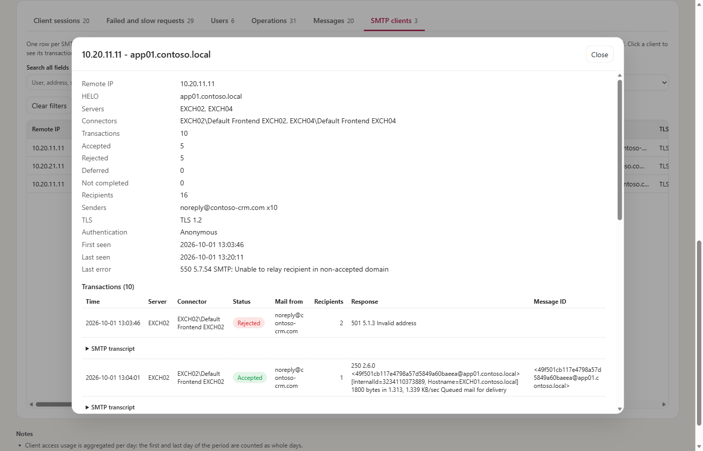
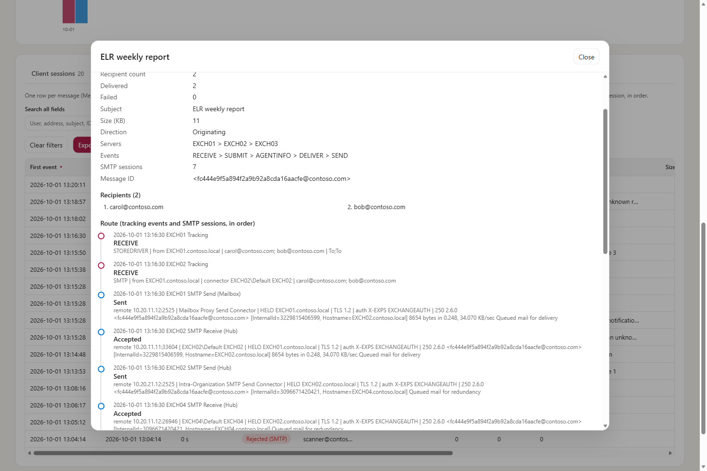

# Exchange Log Report — Administrator guide

> A modern Log Parser for **Exchange Server SE on-premises**: it reads the IIS / HTTP Proxy, MAPI, ActiveSync, POP/IMAP, SMTP and message tracking logs of several servers, removes the noise **before** storage, and answers two questions — **is this server really used?** and **what happened to this user, this client or this message?**

```cards
target | What it answers | Which servers are really used, by whom, with which clients; why a user, a device or a message had a problem.
download | Where the data comes from | The Exchange log files of every server, read **incrementally** (only the new lines).
database | What it keeps | A local **SQLite** history of real activity only: 60 days of usage, 14 days of detail.
file | What it produces | **CSV + HTML** files in a local folder: a usage report or a detailed troubleshooting report.
```

## Quick start

```steps
Check the prerequisites | PowerShell 7.4+ and read access to the log folders of the Exchange servers (simplest: run as SYSTEM on an Exchange server).
List the servers | Open `config\ExchangeLogReport.config.psd1` and fill in the `Servers` section.
Run the first collection | `.\Invoke-ExchangeLogReport.ps1 -Mode Collect` reads the last `BackfillDays` days of logs into the database.
Schedule the collection | `-Mode Collect` every hour (scheduled task as SYSTEM).
Build a report | `.\Invoke-ExchangeLogReport.ps1 -Range Last30Days` (usage) or `-ReportType Detailed -User alice` (troubleshooting).
```

> [!IMPORTANT]
> The tool is **read-only** for Exchange: it only reads log files, never changes a setting and never sends anything. Reports stay on the local disk.

# Part I · Understand

<!-- icon: target -->
## 1. Purpose

Exchange writes several gigabytes of logs per day and per server, and most of it is not user activity: Managed Availability probes, health mailboxes, load balancer checks, anonymous authentication challenges. Log Parser queries were used to answer two recurring questions:

```cards
chart | Usage | Is this server really used? By whom, with which protocols, clients and devices, and how much mail does it handle? Can it be decommissioned?
search | Troubleshooting | What happened to this user, this client or this message: which requests failed, did the client recover, how long did it take, which servers did the connection or the message go through, why was it not delivered?
```

Exchange Log Report answers both from one tool, for several servers at once:

- it reads **only the new part** of the log files, on a schedule;
- it removes the noise **before** anything is stored and counts it by reason;
- it keeps normalised data in a **local SQLite database** (60 days by default);
- it produces **CSV and HTML reports**, either a usage summary or a detailed troubleshooting report, for all users or for one or more users.

<!-- icon: flow -->
## 2. How it works

```flow
server | Exchange servers | IIS / HTTP Proxy, MAPI, ActiveSync, POP/IMAP, SMTP, tracking logs
arrow | new lines | per file, from the last position
filter | Collector | noise removed and counted, data normalised, sessions and messages correlated
arrow | SQL | real activity only
database | SQLite | 60 days of usage, 14 days of detail
arrow | report | on demand
chart | CSV + HTML | usage or detailed troubleshooting report
```

| Source | What the tool takes from it |
|---|---|
| **HttpProxy** (`Logging\HttpProxy\<protocol>`) | Main source of client access: one line per request, with the authenticated user, anchor mailbox, protocol, client, status, back-end status, target server and duration. |
| **IIS front end** (`W3SVC1`) | Sub-status and Win32 status of failed proxied requests (joined on `cafeReqId` = HttpProxy `RequestId`), requests rejected by IIS before reaching the proxy, and the **account of a rejected Basic logon** (`401.1`, Win32 `1326` wrong password, `1909` locked...): HttpProxy logs it as anonymous. |
| **MAPI back end** (`Logging\MapiHttp\Mailbox`) | Outlook version and mode, MAPI status of each request (an HTTP 200 can carry a MAPI failure), Connect / Disconnect / address book Bind. Same `RequestId` as HttpProxy: the back-end detail is attached to the front-end request. |
| **ActiveSync back end** (`W3SVC2`, Exchange Back End) | Only the ActiveSync lines: the ActiveSync result hidden behind HTTP 200 (`DeviceNotProvisioned`, `UserDisabledForSync`...), device access state, protocol version. |
| **POP3 / IMAP4** (`Logging\Pop3`, `Logging\Imap4`, optional) | Front end: client address, logon, back-end server. Back end: every command with its result (`NO`, `BAD`, `-ERR`) and duration. |
| **SMTP protocol logs** (`<role>\ProtocolLog\SmtpReceive|SmtpSend`) | One row per mail transaction (`MAIL FROM` … end of data): remote host, HELO, TLS, authentication, recipients, final response, Message-ID, session transcript. |
| **Message tracking** (`MSGTRK*.log`) | Every event of every real message on every server; consolidated into **one row per Message-ID** with its route. |

Performance-critical work (reading, parsing, SQLite, report files) is done by a C# engine (`src\Engine.*.cs`) compiled automatically on first use, like in Purview DLP Report.

<!-- icon: lightbulb -->
## 3. Things to know

What is removed before storage, counted by reason and never stored:

```cards
user | System mailboxes | Health mailboxes, system and arbitration mailboxes, discovery and migration mailboxes, computer accounts.
search | Monitoring probes | Managed Availability (`AMProbe`, `ActiveMonitoring`) and the MAPI, RPC and EWS test clients of Exchange.
server | Load balancer checks | `healthcheck.htm`, TCP checks on POP/IMAP, SMTP connections without any message (`EHLO` then `QUIT`).
key | Authentication challenges | The anonymous `401` that precedes every NTLM / Kerberos logon: the normal first step, not a failure.
```

> [!NOTE]
> **Noise is removed before storage.** Health mailboxes, Managed Availability probes, load balancer checks, SMTP connections without any message and Exchange internal clients never reach the database: they are only counted by reason (`-Mode Status`). On the lab, 99.9 % of the lines were noise.

> [!TIP]
> **A first failure is not a problem.** An anonymous `401` is the normal first step of NTLM/Kerberos authentication — the "first Autodiscover request fails, then the client connects" case — and is never counted as a failure. A real failure followed by a success of the same user is shown as **Recovered**.

> [!IMPORTANT]
> **Raw log lines are never stored.** The report shows the normalised fields and, for every step of a client session, the log files and a ready-to-copy command that finds the raw lines in the Exchange logs, as long as Exchange keeps them.

> [!WARNING]
> **Detail is kept 14 days, usage 60 days.** Client sessions, failed and slow requests and SMTP transcripts follow `DetailRetentionDays`; daily usage, operations, clients, SMTP transactions and message tracking follow `RetentionDays`. A report on an older period shows the aggregates only.

# Part II · Set up

<!-- icon: checklist -->
## 4. Prerequisites

| Item | Requirement |
|---|---|
| PowerShell | 7.4 or later (`pwsh`). A portable zip is enough: no installation on the Exchange servers. |
| Access to the logs | Read access to the log folders of every server. Simplest: run the tool **as SYSTEM on an Exchange server**: its computer account is a member of *Exchange Trusted Subsystem*, which is administrator of every Exchange server, so `\\<server>\c$` is readable without any password. Otherwise use a service account with read access to the folders. |
| Protocol logging | SMTP: `ProtocolLoggingLevel Verbose` on the receive and send connectors whose traffic must be analysed (`Get-ReceiveConnector | ft Name,ProtocolLoggingLevel`). POP/IMAP (optional): `Set-PopSettings` / `Set-ImapSettings -ProtocolLogEnabled $true`, then restart the POP3/IMAP4 services. HttpProxy, IIS (front and back end), MAPI over HTTP and message tracking are on by default. |
| Disk | The database is small (see chapter 12). Plan 1 GB per server and per month in large environments. |

<!-- icon: download -->
## 5. Installation

```steps
Copy the package | Copy the package folder to the collector, for example `E:\Tools\ExchangeLogReport` (no installer, no module to register).
List the servers | Edit `config\ExchangeLogReport.config.psd1` (chapter 6).
Check the configuration and the engine | `pwsh -File .\Invoke-ExchangeLogReport.ps1 -Mode Status` — a new installation answers **Ready for the first collection**.
Run the first collection | `pwsh -File .\Invoke-ExchangeLogReport.ps1 -Mode Collect` reads `Collection.BackfillDays` days of logs.
Schedule it | Hourly scheduled task (chapter 7), then build the first report (chapter 8).
```

<!-- icon: settings -->
## 6. Configuration

The configuration file is checked at every start; all invalid values are listed at once.

### 6.1 Servers

```powershell
Servers = @(
    @{ Name = 'EXCH01' }                                     # \\EXCH01\c$\Program Files\Microsoft\Exchange Server\V15
    @{ Name = 'EXCH02'; ExchangePath = '\\EXCH02\d$\Exchange' }
    @{ Name = 'EXCH03'; MessageTrackingPath = '\\EXCH03\e$\Logs\MessageTracking' }
)
```

Paths can be overridden per server when the logs were moved: `ExchangePath`, `IisLogPath`, `HttpProxyPath`, `LoggingPath` (Exchange `Logging` folder: MapiHttp, Imap4, Pop3), `TransportLogPath`, `MessageTrackingPath`. Check the real paths with `Get-TransportService | fl *LogPath` and `Get-ExchangeServer | fl DataPath`.

> [!TIP]
> For the server that runs the tool, use local paths: they are faster than its own administrative share.

### 6.2 Sources

| Key | Default | Meaning |
|---|---|---|
| `HttpProxy` | `$true` | Client access (all protocols). |
| `IisFrontEnd`, `IisSite` | `$true`, `W3SVC1` | Default Web Site. |
| `SmtpReceive`, `SmtpSend` | `$true` | SMTP protocol logs of the `TransportRoles` listed (`FrontEnd`, `Hub`, `Mailbox`). A missing folder is not an error (protocol logging not enabled for that role). |
| `MessageTracking` | `$true` | All `MSGTRK*.log` files (hub, delivery, submission, moderation). |
| `MapiBackEnd` | `$true` | `Logging\MapiHttp\Mailbox`: Outlook version and mode, MAPI status codes. |
| `EasBackEnd`, `IisBackEndSite` | `$true`, `W3SVC2` | ActiveSync lines of the Exchange Back End site (the other lines are counted as noise without being parsed). |
| `PopImap` | `$false` | POP3 and IMAP4 protocol logs (front end and back end). Often unused: enable it together with the protocol logging. |

### 6.3 Noise

| Key | Matches | Default (checked on a lab) |
|---|---|---|
| `SystemUserPatterns` | account name, with and without domain | HealthMailbox, SystemMailbox{…}, SM_…, FederatedEmail, Migration, DiscoverySearchMailbox, extest_, computer accounts (`…$`), NT AUTHORITY |
| `ProbeUserAgentPatterns` | user agent (and MAPI client software) | AMProbe, ActiveMonitoring, MSExchangeHM, MapiHttpClient, ExchangeInternalEwsClient, RpcClientAccess.Monitoring |
| `ProbeUrlPatterns` | URL | `healthcheck.htm` (load balancers) |
| `ProbeSenderPatterns` | message sender / SMTP `MAIL FROM` | HealthMailbox, MicrosoftExchange329e71ec…, inboundproxy@ |
| `ExcludedClientIps` | client address prefix | empty |
| `IgnoredTrackingEvents` | tracking event | HARECEIVE, HADISCARD, HAREDIRECT, HAREDIRECTFAIL (shadow redundancy) |

> [!CAUTION]
> Never put in `ExcludedClientIps` a load balancer that hides the client addresses (SNAT): every real request would be removed.

Built-in rules that need no configuration:

- an **anonymous request** is not a user: a `401` without user is the normal first step of NTLM/Kerberos authentication (*Authentication challenge*), it is neither stored nor counted as a failure;
- an **SMTP session without any `MAIL FROM`** (connect, banner, EHLO, QUIT) is a probe or a scanner: it is counted as *Connection without message (address)*, never as a message;
- an **authenticated submission (port 587)** is handed over by the front end to a mailbox server right after `AUTH`: the front-end part is counted as *Client submission proxied to a mailbox server*, and the message is recorded on the mailbox server with the real client read from `XPROXY` (address, HELO);
- a **POP/IMAP connection without logon** (load balancer TCP check) is *connection without logon*; a failed logon whose account Exchange does not log is *logon failed (the account is not logged)*;
- **back-end lines older than the detail retention** are not parsed (they only enrich sessions).

### 6.4 Collection, storage, report, logging

| Key | Default | Meaning |
|---|---|---|
| `Collection.BackfillDays` | 14 | First collection: files modified in the last N days. |
| `Collection.RecoveryWindowMinutes` | 30 | A failure followed within N minutes by a success of the same user and protocol is **Recovered**. |
| `Collection.SmtpSessionIdleMinutes` | 10 | An SMTP, IMAP or POP session open at the end of the current file is read again at the next collection (complete), unless idle this long. |
| `Collection.FullDetailUsers` | `@()` | Users whose **successful** requests are kept too (incident on a VIP: add, collect, report, remove). |
| `Collection.StoreAllRequests` | `$false` | Keeps every request of every real user (test environments only). |
| `Collection.SessionIdleMinutes` | 30 | A client session ends after this inactivity (sessions are also cut at midnight). |
| `Collection.SessionDetailRequests` | 40 | The first N requests of a session are always kept one by one in its timeline. |
| `Collection.MaxSessionSteps` | 80 | Timeline steps written per session and log file; the other successes are folded into batches. |
| `Collection.SlowRequestMs` | 5000 | Successful requests slower than this are kept as **Slow** (0 = never). Applied at collection: changing it does not recompute the history. |
| `Collection.LongRunningPatterns` | NotificationWait, Ping, RPC/HTTP, OWA notifications, PowerShell, IMAP IDLE | Long-polling requests (regex on `Protocol|Action|Url`): never slow. |
| `Storage.RetentionDays` | **60** | Daily usage, operations, clients and devices, SMTP transactions, message tracking. |
| `Storage.DetailRetentionDays` | **14** | Failed and slow requests, client sessions and their timeline, SMTP session transcripts. |
| `Report.DefaultType` | `Usage` | `Usage` or `Detailed`. |
| `Report.IncludeRoutingDetails` | `$true` | Message route and SMTP transcripts **in the CSV files** (always available behind a click in HTML). |
| `Report.IncludeSessionDetails` | `$true` | Timeline of each client session **in the CSV files** (always available behind a click in HTML). |
| `Report.MaxHtmlRows` | 200,000 | Per table in the HTML file; the CSV files are always complete. |
| `Logging.RetentionDays` | **14** | Daily execution log files. |

<!-- icon: clock -->
## 7. Scheduled collection

Run the collection every hour (Exchange closes HttpProxy files every hour). Example with the task running as SYSTEM on an Exchange server:

```powershell
$action  = New-ScheduledTaskAction -Execute 'E:\Tools\pwsh\pwsh.exe' `
           -Argument '-NoProfile -ExecutionPolicy Bypass -File E:\Tools\ExchangeLogReport\Invoke-ExchangeLogReport.ps1 -Mode Collect' `
           -WorkingDirectory 'E:\Tools\ExchangeLogReport'
$trigger = New-ScheduledTaskTrigger -Once -At (Get-Date).Date.AddHours(1) -RepetitionInterval (New-TimeSpan -Hours 1)
Register-ScheduledTask -TaskName 'Exchange Log Report - collect' -Action $action -Trigger $trigger -User 'SYSTEM' -RunLevel Highest
```

```cards
check | Exit code 0 | Success.
wrench | Exit code 1 | Failure: see the error and the log file.
info | Exit code 2 | Finished but incomplete: a server or a file could not be read (see the log file).
shield | Lock | A lock file prevents two collections at the same time; reports can still be built from the data already collected (-NoCollect).
```

# Part III · Use

<!-- icon: terminal -->
## 8. Everyday use

```powershell
# Which servers are really used (last 30 days)
.\Invoke-ExchangeLogReport.ps1 -Range Last30Days

# Everything about one user yesterday
.\Invoke-ExchangeLogReport.ps1 -Range Day -Date 2026-09-30 -ReportType Detailed -User alice@contoso.com

# What Outlook, the phone and the mail client of one user did this morning (sessions and timelines)
.\Invoke-ExchangeLogReport.ps1 -Range Custom -Start '2026-10-01 08:00' -End '2026-10-01 12:00' `
    -ReportType Detailed -User alice

# An incident window on two servers, from the data already collected
.\Invoke-ExchangeLogReport.ps1 -Range Custom -Start '2026-09-23 08:00' -End '2026-09-23 12:00' `
    -ReportType Detailed -Server EXCH01,EXCH02 -NoCollect

# What the database contains, and the noise removed by the last collection
.\Invoke-ExchangeLogReport.ps1 -Mode Status
```

```cards
calendar | -Range | Last24Hours, Last7Days, Last30Days, PreviousMonth, Month (with -Month), Day (with -Date) or Custom (with -Start and -End).
layers | -ReportType | Usage (who uses which server) or Detailed (+ sessions, failures, messages).
people | -User | Any part of the account (domain\sam), UPN or SMTP address; filters every view.
server | -Server | One or more servers of the configuration (report and collection).
```

`-User` filters client access, client sessions, messages (as sender or recipient) and SMTP clients. The *Operations* view is measured per server, not per user: it is not built when the report is filtered on users.



<!-- icon: chart -->
## 9. Reading the report



- **Servers really used**: a server is *In use*, *Client access only*, *Mail flow only* or *No real usage* — the answer to "can this server be decommissioned?".
- **Server cards**: real users, requests, unresolved failures, SMTP in/out, messages, protocol bars and a daily trend. Click a card for details.
- **Activity by day**: client requests and messages per day.
- **Tabs**: search box, filters, sortable columns, virtual scrolling (hundreds of thousands of rows), *Export view to CSV*. Click a row for all its details.

### 9.1 The six tabs

| Tab | One row per | Click a row |
|---|---|---|
| **Client sessions** (Detailed) | client session: one user, one client, one day, until idle | timeline, then each step: detail and raw log location |
| **Failed and slow requests** (Detailed) | failed or slow request (all users of one server at one time: server incident) | every field |
| **Users** | real user | protocols, clients and devices, client sessions (open one from there) |
| **Operations** | protocol × operation, server-wide | every field |
| **Messages** (Detailed) | message, or mail refused during the SMTP conversation | recipients, route, SMTP transcripts |
| **SMTP clients** | SMTP client (address + HELO) | its transactions (refusals first) with their transcript |

### 9.2 Client sessions and their timeline



One line per session: user, protocol, client, address, front-end and back-end servers, requests, failures, slow requests, latency, operations, Outlook version and mode or mobile device. The dialog shows its **timeline**: every failure (red), slow request and milestone (Connect, Provision, logon...) with its front end > back end path and duration, the back-end detail attached to the front-end request (blue), and the other successes folded together (grey). Long healthy sessions stay short, problems keep their detail.

**Click a step** of the timeline to see what the report keeps for that request (every field for a failed or slow request, or a request of `FullDetailUsers`; time, servers, status and duration for the others) and **where its raw lines are**: the front-end and back-end log files (server, folder, hourly file) with a ready-to-copy `Select-String` command (RequestId for HttpProxy, IIS and MAPI; time and command for the ActiveSync back end; time and session for IMAP/POP).



> [!NOTE]
> The paths are those seen by the collector: run the command from the collector (or adapt the path). Exchange deletes its logs after its own retention: an old file may be gone.

### 9.3 Users, operations and SMTP clients

The detail of a **user** lists its clients and devices (which Outlook builds and mobile devices are still used) and its client sessions. **Operations** shows which operation is slow or fails, with its share of the protocol. **SMTP clients** answers "which applications, devices and servers still send mail through these servers?" before a decommissioning: address, HELO name, connectors, volume, refusals, TLS and authentication; the detail lists the transactions with their SMTP transcript. Hops between the collected Exchange servers are not listed.



### 9.4 Messages



The **Messages** tab keeps one line per message; the dialog shows the recipients with their own status, the **route** (every tracking event and SMTP session, in order, on every server) and the SMTP transcripts. Mail refused during the SMTP conversation (relay denied, unknown recipient: no Message-ID) has its own line.

### 9.5 Statuses

| Client access | Meaning |
|---|---|
| `Success` / `ClientError` / `ServerError` | HTTP status 1xx–3xx / 4xx / 5xx of the request. |
| **Recovered** (`Recovered after`) | A success of the same user and protocol followed within the recovery window. |
| **Recovered later** | A success came later the same (or next) day. |
| **Unresolved** | No success afterwards: the user really had a problem. |
| **Slow** (`Slow success`) | Successful, but slower than `SlowRequestMs` (long-polling requests excluded). |

| Client session | Meaning |
|---|---|
| OK / OK (slow) | No failure (some slow requests). |
| Recovered | Failures (HTTP, MAPI or ActiveSync status), then the session ended with successes: e.g. 401.1 wrong password then the right one, `DeviceNotProvisioned` then provisioning. |
| Intermittent errors | At least 3 failures spread over more than the recovery window, after a first success. |
| Failed at end | The last request of the session failed. |
| Failed | No success at all. |

| Message | Meaning |
|---|---|
| Delivered | Every recipient has a `DELIVER` event. |
| Relayed / Delivered and relayed | Handed over (`SEND`) to a server outside the collected servers (Edge, internet, other organisation). |
| Failed / Partially failed | `FAIL` for all / some recipients (see their status and the NDR reason). |
| Deferred | Last event `DEFER`: still in a queue. |
| Dropped | `DROP` (transport rule, malware…). |
| In transit | Received, nothing final yet (or the next server is not collected). |
| Rejected (SMTP) / Deferred (SMTP) / Not completed (SMTP) | Refused (`5xx` / `4xx`) during the SMTP conversation, or the client left before the data: no Message-ID, no tracking event (relay denied, unknown recipient, size limit...). |

| SMTP transaction | Meaning |
|---|---|
| Accepted / Sent | `2xx` after the data. |
| Rejected / Deferred | `5xx` / `4xx` (during `RCPT` or after the data). |
| Incomplete | The session ended before the data. |

<!-- icon: layers -->
## 10. Output files

Each execution writes a new folder `<FilePrefix>_<Type>_<period>[_<users>]_<time>` under `Report.OutputPath`:

| File | Usage | Detailed | Content |
|---|---|---|---|
| `….html` | ✓ | ✓ | Self-contained dashboard (no internet access needed). |
| `…-Servers.csv` | ✓ | ✓ | One row per configured server: verdict, real users, requests, failures, protocols, SMTP, messages. |
| `…-Daily.csv` | ✓ | ✓ | Per day and server. |
| `…-Users.csv` | ✓ | ✓ | One row per real user: protocols, clients, servers, failures, last IP and client. |
| `…-Clients.csv` | ✓ | ✓ | One row per user × protocol × client (user agent or ActiveSync device): versions, devices, addresses, servers. |
| `…-Operations.csv` | ✓ | ✓ | One row per protocol × operation: volume, failure rate, slow requests, average and maximum latency. |
| `…-SmtpClients.csv` | ✓ | ✓ | One row per SMTP client (address + HELO): volume, refusals, TLS, authentication, senders. |
| `…-ClientAccess-Daily.csv` | ✓ | ✓ | Per day × server × user × protocol (the detail behind the usage views). |
| `…-ClientSessions.csv` |  | ✓ | **One row per client session** with its outcome (`Timeline` column if `IncludeSessionDetails`). |
| `…-ClientAccess-Requests.csv` |  | ✓ | Every failed request with its **resolution**, every **slow** success, every request of `FullDetailUsers`. |
| `…-Messages.csv` |  | ✓ | **One row per message** with status and route (`Route` column if `IncludeRoutingDetails`), plus the mail refused during the SMTP conversation. |
| `…-SmtpSessions.csv` |  | ✓ | One row per SMTP transaction, every hop included (`Transcript` column if `IncludeRoutingDetails`). |

> [!TIP]
> The CSV files are always complete; the HTML file shows up to `MaxHtmlRows` rows per tab. `SmtpSessions.csv` has every SMTP hop: in the HTML report, these transactions are in the route of their message and in the detail of their SMTP client.

# Part IV · Maintain

<!-- icon: gear -->
## 11. Inside the tool

### 11.1 Correlation rules

```cards
compare | IIS ↔ HttpProxy | The cafeReqId of the IIS query string is the RequestId of HttpProxy.
refresh | Failure ↔ recovery | Same user, same protocol, success within RecoveryWindowMinutes, on any server (a client retried on another server behind the load balancer is recovered too).
mail | SMTP ↔ tracking | The Message-ID returned in the SMTP 250 response (or logged as InternetMessageId) is the Message-ID of message tracking.
layers | One message, many servers | Tracking events of all servers are grouped by Message-ID.
```

```flow
terminal | Front end | HttpProxy, IIS, POP/IMAP proxy
arrow | RequestId | user, client
server | Back end | MAPI, ActiveSync, POP/IMAP
arrow | merged | one timeline
people | Client session | one user, one client, until idle
arrow | each step | fields kept
search | Raw log location | log files, ready-to-copy command
```

```flow
mail | SMTP conversation | MAIL FROM … 250 <message-id>
arrow | Message-ID | 
layers | Message tracking | events of every server
arrow | grouped | in time order
file | One row per message | status, recipients, route, transcripts
```

- **Client session**: one user, one client, one day, until idle for `SessionIdleMinutes`. Key per protocol: MAPI = client address + mailbox GUID + client instance (`X-ClientInfo` of Outlook, logged in `ClientRequestId` as `CI:`); ActiveSync = user agent (devices change address); IMAP/POP = client address; others = client address + user agent. Requests of every front end are merged (no load balancer affinity needed); a request filling the gap between two sessions merges them.
- **MAPI front end ↔ back end**: same key computed from `Logging\MapiHttp\Mailbox` (user, `ClientIP`, `MailboxId`, `MapiClientInfo`); same `RequestId` for the detail of one request.
- **ActiveSync front end ↔ back end**: same user and user agent in `W3SVC2` (`Log=Error:…`, `As:`, `Ver1:`).
- **IMAP/POP front end ↔ back end**: the back end only knows the front-end server: its connections are attached, at the end of the collection, to the session of the same user and protocol whose proxy target is that back end, at the same time; otherwise they get their own session *via* the front end.
- **SMTP submission (587)**: the real client of a session proxied by a front end is read from `XPROXY` on the mailbox server.
- **Identities**: `sam` or `sam@upn-suffix` (IMAP, POP, back-end logs) becomes `domain\sam` when that account is already known (and not ambiguous between two domains).

### 11.2 Data model

| Table | Content | Retention |
|---|---|---|
| `access_usage` | Day × server × user × protocol: requests, successes, errors, slow, bytes, durations, first/last time, last IP and client | `RetentionDays` |
| `access_event` | Failed and slow requests (and watched users): every field useful for troubleshooting, recovery time | `DetailRetentionDays` |
| `access_action` | Day × server × protocol × operation: requests, failures, slow, total and maximum duration | `RetentionDays` |
| `access_client` | Day × user × protocol × address × user agent × device: requests, failures, servers | `RetentionDays` |
| `client_session` | One row per client session: counters, servers, client, errors, back-end information | `DetailRetentionDays` |
| `session_step` | Timeline of a session: one JSON row per session and log file read (with the log file of each step) | `DetailRetentionDays` |
| `iis_status` | IIS sub-status / Win32 status of failed proxied requests | `DetailRetentionDays` |
| `smtp_transaction` | SMTP transactions; `transcript` | `RetentionDays`; transcript `DetailRetentionDays` |
| `message_event` | Tracking events of real messages | `RetentionDays` |
| `source_file` | Read position of every log file | as long as the file exists |
| `noise`, `run` | Removed lines per reason and execution | `RetentionDays` |

Raw log lines are **never** stored. A database of an older version is upgraded automatically (new tables and columns only).

<!-- icon: database -->
## 12. Volumes

Measured on the lab on 2026-10-01 (4 servers, 60 days of logs):

| | 1.0.0 (front end, SMTP, tracking) | 1.1.0 and later (+ MAPI and ActiveSync back end, IMAP, POP) |
|---|---|---|
| Read | 1.00 GB, 8,365 files, 2,966,989 lines | 1.81 GB, 9,422 files, 5,525,182 lines |
| Kept | 2,327 lines — **99.9 % noise removed** | 4,891 lines — **99.9 % noise removed** |
| Database | 16.4 MB | 18.1 MB |
| Duration | 2 min 59 s (cold cache) | 50 s (warm cache; local files 10–40 MB/s, shares 9–35 MB/s) |
| Report (detailed) | 0.5 s (30 days) | 0.6 s (24 hours, 20 sessions, 14 messages) |

The back-end logs are large (`W3SVC2` ~120 MB and `MapiHttp\Mailbox` ~95 MB per server over the detail retention, almost only probes): only the ActiveSync lines of `W3SVC2` are split, the others are counted as noise by a simple text search, and back-end lines older than `DetailRetentionDays` are not parsed.

Main noise found: Managed Availability probes (1.5 million lines), back-end traffic other than ActiveSync (1.7 million), Azure load balancer SMTP probe `168.63.129.16` (584,000), back-end lines older than the detail retention (513,000), health mailboxes (200,000).

> [!NOTE]
> In production (1–3 GB of logs per day and server) the database grows with the number of **real users** and **messages**, not with the log volume: about one `access_usage` row per user, protocol, server and day, one `message_event` row per tracking event of a real message. For very large mail volumes, lower `RetentionDays` or run one database per site.

<!-- icon: wrench -->
## 13. Modifying the tool

| Change | Where |
|---|---|
| A noise rule (account, client, URL, sender) | `config\…psd1`, section `Noise`. New lines are filtered at the next collection; what is already stored is not changed. |
| Texts, colours, tabs, columns shown | `templates\Report.template.html` (no rebuild). Columns are described in the report metadata. |
| Parsing, a new field, a new status | `src\Engine.Collector.cs` (collection), `src\Engine.Sessions.cs` (sessions, back-end logs, POP/IMAP), `src\Engine.Report.cs` and `src\Engine.ReportSessions.cs` (datasets). The engine is recompiled automatically at the next start (hash of the sources). Add a test. |
| Database schema | `src\Engine.Store.cs` (`Schema`, `Migrate`). New tables: `CREATE … IF NOT EXISTS`; a new column of an existing table: `ALTER TABLE` in `Migrate` (done at the next collection) and a new `schema_version`. |
| Console output | `ExchangeLogReport.psm1`, region 1 (same functions as Purview DLP Report). |
| This guide | `docs\ExchangeLogReport-Guide.md`, then `.\tools\Build-Documentation.ps1` (also run by the package tool). |
| README graphics (GitHub) | `.\tools\New-DocumentationImages.ps1` renders `docs\images\readme-*.png` (light and dark) from the cards and flow blocks of this guide, with its CSS and icons (Microsoft Edge, headless). Run it after `Build-Documentation.ps1` when chapters 1, 2, 3 or 11 change. |
| Version | `ExchangeLogReport.psd1` (`ModuleVersion`), `$script:ToolVersion` in the module, headers, front matter of this guide, `CHANGELOG.md`. |

```steps
Test | `Invoke-Pester -Path .\tests\ExchangeLogReport.Tests.ps1 -Output Detailed` — no Exchange needed: the logs are generated with the exact Exchange formats.
Build the guide | `.\tools\Build-Documentation.ps1` writes `docs\ExchangeLogReport-Guide.html` (self-contained: images inline).
Build the package | `.\tools\New-ExchangeLogReportPackage.ps1` — no database, no reports, no logs; the HTML guide is included.
```

<!-- icon: beaker -->
## 14. Validation in the lab

Four Exchange Server SE mailbox servers EXCH01 to EXCH04 (two Active Directory sites, one DAG), collector on EXCH01 as SYSTEM, PowerShell 7.6.6 portable, 60 days of logs:

- EXCH01: *Client access only* — one real user (the lab administrator, remote PowerShell and OWA);
- EXCH02, EXCH03, EXCH04: *No real usage* — everything was probes and health mailboxes;
- 197 unresolved `PowerShell Ping` requests in HTTP 500 on 2026-09-23 every 3 minutes: an EMS session left open whose back end no longer answered — found without any manual query;
- no message and no SMTP transaction: no mail flow in the lab in that period (last tracking log 2026-07-28); the 288,000 SMTP lines per server were load balancer and local probes.

### 14.1 Generated traffic

Six test mailboxes spread over the four databases and two sites, traffic sent from EXCH01 and EXCH03 to the four front ends directly (like a load balancer without affinity), for 15 minutes:

| Client | Scenario | What the report shows |
|---|---|---|
| Outlook (MAPI over HTTP, Autodiscover, EWS, OAB) | 4 Outlook starts (Connect, Execute, PING, address book Bind/Unbind, Disconnect) | 4 MAPI sessions (one per client instance), front end > back end path, back-end detail (`MAPI OK`, `OwnerLogoff`) on Connect/Disconnect; OAB download *Failed* (404) |
| iPhone (ActiveSync) | Provisioning then FolderSync / Sync / Ping, 3 times | *Recovered*: `FolderSync 200` with a **back-end error `DeviceNotProvisioned`** then `InvalidPolicyKey`, provisioning, then sync OK; Ping excluded from slow requests |
| Android (ActiveSync), user blocked | `ActiveSyncEnabled $false` | *Failed*: every `FolderSync 200` / `Provision 200` is **`UserDisabledForSync`** in the back end, each answered after **19 s** (Exchange delays blocked devices) |
| iPhone, wrong password | Basic authentication | *Failed*: `401.1`, Win32 `1326` attributed to the account from IIS (HttpProxy only logs an anonymous 401) |
| OWA (forms logon) | Logon on a front end of the other site | Logon redirected to the OWA URL of the mailbox site, first page *Slow* (6.2 s) |
| CRM application (EWS) | Malformed SOAP request then valid requests | *Recovered* (400 then 200) |
| Outlook for Mac | Autodiscover, EWS, a request to a missing page | *Failed at end* (404) |
| IMAP / POP / SMTP client | IMAP and POP over TLS, SMTP submission (587) | IMAP front-end connections and back-end commands in one session (LOGIN 9.5 s *Slow*, `FETCH` refused on an empty mailbox), POP without error; the 587 submissions in **SMTP clients** with the real client (`XPROXY`) |
| POP disabled | `PopEnabled $false` | *Failed*: `PASS -ERR` |
| Application relay (SMTP 25) | Messages to two recipients, unknown recipient, relay attempt outside, scanner | One row per message with its route (front end, hub, mailbox delivery); refused relay and invalid addresses as *Rejected (SMTP)* in **Messages**; the application and the scanner in **SMTP clients** |

Result: 20 client sessions (9 with failures), 29 failed or slow requests, 20 messages (6 refused during the SMTP conversation), 3 SMTP clients, every server *In use*. The step commands found the raw lines on the servers (HttpProxy `Execute` on EXCH02, `W3SVC2` `UserDisabledForSync` on EXCH01).

# Annexes

<!-- icon: lifebuoy -->
## Annex A — Troubleshooting

| Symptom | Cause and action |
|---|---|
| `folder not found or not readable` | Wrong path or no access. Test `Test-Path '\\<server>\c$\Program Files\Microsoft\Exchange Server\V15\Logging\HttpProxy'` as the account of the task. With SYSTEM on an Exchange server, check that the computer account is in *Exchange Trusted Subsystem*. |
| A server is *No real usage* but users say they use it | Check the load balancer (are requests reaching it?) and the noise counters in `-Mode Status`: a too broad `SystemUserPatterns` or `ExcludedClientIps` rule can remove real users. |
| Every user comes from the same IP | The load balancer uses SNAT. Usage is right; for client addresses enable `X-Forwarded-For` on the load balancer (HttpProxy logs it in `ClientIpAddress`). |
| No IMAP / POP session | `Sources.PopImap` is `$false`, or protocol logging is off (`Get-ImapSettings | fl ProtocolLogEnabled`): enable it and restart the IMAP4 / POP3 services (front end and back end). |
| A session ends *Failed* although the client works | Look at the timeline: an `OPTIONS` / `LOGOUT` success says nothing about the session; a back-end error behind HTTP 200 counts as a failure. A long-polling request not listed in `LongRunningPatterns` can also appear as *Slow*. |
| Same user split between `domain\sam` and `sam` | IMAP, POP and some back-end logs give the account without domain: it is merged with `domain\sam` once this account has been seen in a front-end log. |
| No SMTP transaction | Protocol logging is off on the connectors (`Set-ReceiveConnector -ProtocolLoggingLevel Verbose`), or all sessions were probes (see *Connection without message* in `-Mode Status`). |
| SMTP clients shows a front-end server as client | Submissions proxied by a front end are shown with their real client only when the mailbox server logs `XPROXY` (Exchange 2016 and later): check that protocol logging is on for the *Client Proxy* receive connector of the mailbox servers. |
| Messages *In transit* | The next server of the route is not in the configuration, or its tracking logs are not readable yet. |
| `Another execution is already collecting` | A collection is running (lock `…sqlite.lock`). Use `-NoCollect` for a report, or wait. |
| `Unable to load the engine` / compilation error after an edit | Fix the C# error shown, or delete `bin\` to force a rebuild. |
| The report is slow to open | More than ~200,000 rows: lower `MaxHtmlRows` and use the CSV, or narrow the period / users. |
| Collection slow on remote servers | Administrative shares are slower than local disks: run one collector per site, or schedule hourly so that each run reads one hour only. |

<!-- icon: file -->
## Annex B — Exchange log fields used

| Source | Fields |
|---|---|
| HttpProxy | DateTime, RequestId, ClientRequestId (`RT:` MAPI request type, `CI:` Outlook client instance), Protocol, UrlStem, UrlQuery (`Cmd`, `DeviceId`, `DeviceType` of ActiveSync), ProtocolAction, AuthenticationType, AuthenticatedUser, AnchorMailbox, UserAgent, ClientIpAddress, HttpStatus, BackEndStatus, ErrorCode, Method, TargetServer, RoutingType, RequestBytes, ResponseBytes, TotalRequestTime, GenericErrors |
| IIS (W3C) | date, time, cs-method, cs-uri-stem, cs-uri-query (`cafeReqId`), cs-username, c-ip, cs(User-Agent), sc-status, sc-substatus, sc-win32-status, sc-bytes, cs-bytes, time-taken |
| MapiHttp (back end) | DateTime, RequestId, RequestType, HttpStatusCode, ResponseCode, StatusCode, ReturnCode, TotalRequestLatency, AuthenticatedUserEmail, MailboxId, ClientIP, SourceCafeServer, MapiClientInfo, ClientSoftware, ClientSoftwareVersion, ClientMode, OperationSpecific, GenericErrors |
| IIS back end (`W3SVC2`) | ActiveSync lines only: cs-uri-query (`Cmd`, `DeviceId`, `Log=` tokens `Error`, `As`, `Ver1`), cs-username, cs(User-Agent), sc-status, time-taken |
| POP3 / IMAP4 | dateTime, sessionId, cIp, user, duration, rqsize, rpsize, command, parameters, context (`R=` result, `Proxy:` back-end server) |
| SMTP protocol | date-time, connector-id, session-id, local-endpoint, remote-endpoint, event (`+ - > < *`), data (`XPROXY` of proxied submissions), context |
| Message tracking | date-time, client-ip, client-hostname, server-ip, server-hostname, source-context, connector-id, source, event-id, internal-message-id, message-id, network-message-id, recipient-address, recipient-status, total-bytes, recipient-count, related-recipient-address, reference, message-subject, sender-address, return-path, message-info, directionality, log-id |

The columns are found by name in the `#Fields:` header of each file: a different column order or an Exchange update adding columns does not break the parsing.

<!-- icon: tag -->
## Annex C — Versioning

MAJOR.MINOR.PATCH: MAJOR for a database or configuration change that needs action, MINOR for a new feature, PATCH for a fix. Every change is listed in `CHANGELOG.md`.
