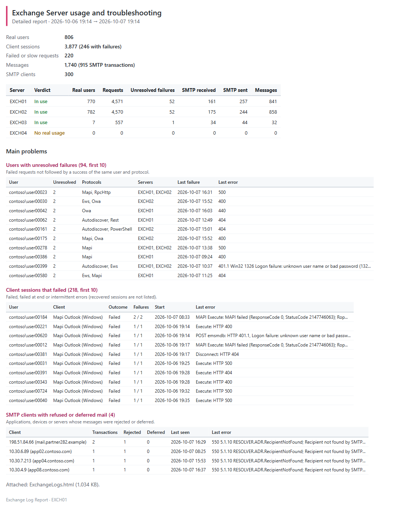

# Exchange Log Report — Developer guide

> A modern Log Parser for **Exchange Server SE on-premises**: it reads the IIS / HTTP Proxy, MAPI, ActiveSync, POP/IMAP, SMTP and message tracking logs of several servers, removes the noise **before** storage, and answers two questions — **is this server really used?** and **what happened to this user, this client or this message?**

> [!IMPORTANT]
> Files downloaded from the Internet may be blocked by Windows and fail to run. Before using this project, unblock every file in the downloaded folder:
>
> ```powershell
> Get-ChildItem "C:\Chemin\Du\Dossier" -Recurse -File -Force | Unblock-File
> ```
>
> Replace the example path with the folder where you downloaded or extracted this project.

> [!NOTE]
> This is the **developer guide**: how the tool works, the configuration in detail, every tab of the report, the correlation rules, the data model and how to modify the tool. For the prerequisites and the everyday commands only, read the [user guide](ExchangeLogReport-UserGuide.md).

```cards
target | What it answers | Which servers are really used, by whom, with which clients; why a user, a device or a message had a problem.
download | Where the data comes from | The Exchange log files of every server, read **incrementally** (only the new lines).
database | What it keeps | A local **SQLite** history of real activity only: 60 days of usage, 14 days of detail.
file | What it produces | **CSV + HTML** files in a local folder: a usage report or a detailed troubleshooting report.
```

## Quick start

```path
Set up once | settings | Set up once: then the collection runs by itself every hour
Set up once | 1 | List the servers | write their names in the configuration
Set up once | 2 | Find the log folders | `-Mode Discover`, with your administrator account
Set up once | 3 | Collect every hour | a scheduled task; its first run reads 14 days of logs
Set up once | 4 | Check | `-Mode Status`: every server has data
A | chart | Recurring reporting
A | 5 | Schedule the reports | every morning the last 24 hours, every month the last month
A | 6 | Open the report | the HTML file in the reports folder
A | 7 | Option: by e-mail | the same reports, sent to your team
B | search | Troubleshooting on demand
B | 5 | Run a Detailed report | on the user and the hours of the problem
B | 6 | Open the client session | HTML report, **Client sessions** tab
B | 7 | Follow the timeline | each step: what failed, and where its raw log lines are
```

Every step with its exact command, on one example (EXCH01 to EXCH04, contoso.com, alice): [user guide, chapters 3 to 5](ExchangeLogReport-UserGuide.md#1-start-here). The account and the prerequisites: chapter 4; the scheduled tasks: chapter 7; the e-mail: 8.1.

> [!IMPORTANT]
> The tool is **read-only** for Exchange: it reads log files and, with `-Mode Discover`, settings (`Get-*` cmdlets and IIS `applicationHost.config`). It never changes a setting. Reports stay on the local disk, unless the `Mail` section sends them by e-mail (chapter 8.1).

# Part I · Understand

<!-- icon: target -->
## 1. Purpose

Exchange writes several gigabytes of logs per day and per server, and most of it is not user activity: Managed Availability probes, health mailboxes, load balancer checks, anonymous authentication challenges. Log Parser queries were used to answer two recurring questions:

```cards
chart | Usage | Is this server really used? By whom, with which protocols, clients and devices, and how much mail does it handle? Can it be decommissioned?
search | Troubleshooting | What happened to this user, this client or this message: which requests failed, did the client recover, how long did it take, which servers did the connection or the message go through, why was it not delivered?
```

Exchange Log Report answers both from one tool, for several servers at once:

- it reads **only the new part** of the log files, on a schedule;
- it removes the noise **before** anything is stored and counts it by reason;
- it keeps normalised data in a **local SQLite database** (60 days by default);
- it produces **CSV and HTML reports**, either a usage summary or a detailed troubleshooting report, for all users or for one or more users.

<!-- icon: flow -->
## 2. How it works

```flow
server | Exchange servers | IIS / HTTP Proxy, MAPI, ActiveSync, POP/IMAP, SMTP, tracking logs
arrow | new lines | per file, from the last position
filter | Collector | noise removed and counted, data normalised, sessions and messages correlated
arrow | SQL | real activity only
database | SQLite | 60 days of usage, 14 days of detail
arrow | report | on demand
chart | CSV + HTML | usage or detailed troubleshooting report
```

| Source | What the tool takes from it |
|---|---|
| **HttpProxy** (`Logging\HttpProxy\<protocol>`) | Main source of client access: one line per request, with the authenticated user, anchor mailbox, protocol, client, status, back-end status, target server and duration. |
| **IIS front end** (`W3SVC1`) | Sub-status and Win32 status of failed proxied requests (joined on `cafeReqId` = HttpProxy `RequestId`), requests rejected by IIS before reaching the proxy, and the **account of a rejected Basic logon** (`401.1`, Win32 `1326` wrong password, `1909` locked...): HttpProxy logs it as anonymous. |
| **MAPI back end** (`Logging\MapiHttp\Mailbox`) | Outlook version and mode, MAPI status of each request (an HTTP 200 can carry a MAPI failure), Connect / Disconnect / address book Bind. Same `RequestId` as HttpProxy: the back-end detail is attached to the front-end request. |
| **ActiveSync back end** (`W3SVC2`, Exchange Back End) | Only the ActiveSync lines: the ActiveSync result hidden behind HTTP 200 (`DeviceNotProvisioned`, `UserDisabledForSync`...), device access state, protocol version. |
| **POP3 / IMAP4** (`Logging\Pop3`, `Logging\Imap4`, optional) | Front end: client address, logon, back-end server. Back end: every command with its result (`NO`, `BAD`, `-ERR`) and duration. |
| **SMTP protocol logs** (`<role>\ProtocolLog\SmtpReceive|SmtpSend`) | One row per mail transaction (`MAIL FROM` … end of data): remote host, HELO, TLS, authentication, recipients, final response, Message-ID, session transcript. |
| **Message tracking** (`MSGTRK*.log`) | Every event of every real message on every server; consolidated into **one row per Message-ID** with its route. |

Performance-critical work (reading, parsing, SQLite, report files, e-mail) is done by a C# engine (`src\Engine.*.cs`) compiled automatically on first use, like in Purview DLP Report.

A collection reads **every server and every source at the same time** (2.0.0):

```flow
folder | List | every log folder of every server, in parallel
arrow | new files | read position in the database
terminal | Parse threads | one file each (Collection.Parallelism): noise removed, records and aggregates of the file
arrow | records | in memory
database | Write thread | sessions, recoveries, rows; one transaction per batch of files, with their read positions
arrow | rows | as soon as a source is done
chart | Console | one row per server and source, progress bar for the whole collection
```

The parse threads share nothing but the noise rules: everything that depends on the other files (the `domain\sam` form of an account, the client sessions, the recoveries) is done by the write thread, the only one that uses the database. HttpProxy files are read first (they teach the `domain\sam` accounts), SMTP and message tracking fill the threads meanwhile, and the back-end logs (IIS, MAPI, ActiveSync, POP/IMAP) start once HttpProxy is written. A file is either written whole with its new read position, or not at all: an interrupted collection (Ctrl+C, reboot, error) resumes where it stopped, without duplicates.

<!-- icon: lightbulb -->
## 3. Things to know

What is removed before storage, counted by reason and never stored:

```cards
user | System mailboxes | Health mailboxes, system and arbitration mailboxes, discovery and migration mailboxes, computer accounts.
search | Monitoring probes | Managed Availability (`AMProbe`, `ActiveMonitoring`) and the MAPI, RPC and EWS test clients of Exchange.
server | Load balancer checks | `healthcheck.htm`, TCP checks on POP/IMAP, SMTP connections without any message (`EHLO` then `QUIT`).
key | Authentication challenges | The anonymous `401` that precedes every NTLM / Kerberos logon: the normal first step, not a failure.
```

> [!NOTE]
> **Noise is removed before storage.** Health mailboxes, Managed Availability probes, load balancer checks, SMTP connections without any message and Exchange internal clients never reach the database: they are only counted by reason (`-Mode Status`). On the lab, 99.9 % of the lines were noise.

> [!TIP]
> **A first failure is not a problem.** An anonymous `401` is the normal first step of NTLM/Kerberos authentication — the "first Autodiscover request fails, then the client connects" case — and is never counted as a failure. A real failure followed by a success of the same user is shown as **Recovered**.

> [!IMPORTANT]
> **Raw log lines are never stored.** The report shows the normalised fields and, for every step of a client session, the log files and a ready-to-copy command that finds the raw lines in the Exchange logs, as long as Exchange keeps them.

> [!WARNING]
> **Detail is kept 14 days, usage 60 days.** Client sessions, failed and slow requests and SMTP transcripts follow `DetailRetentionDays`; daily usage, operations, clients, SMTP transactions and message tracking follow `RetentionDays`. A report on an older period shows the aggregates only.

# Part II · Set up

<!-- icon: checklist -->
## 4. Prerequisites

| Item | Requirement |
|---|---|
| PowerShell | **7.4 or later** (`pwsh`) for the tool. A portable zip is enough: no installation on the Exchange servers. **Windows PowerShell 5.1** (`powershell.exe`, part of Windows Server) for `-Mode Discover` only: the Exchange cmdlets are not supported in PowerShell 7, so the tool runs them in a Windows PowerShell 5.1 process. |
| Account | SYSTEM on an Exchange server, or a domain account that is local administrator of every Exchange server (4.1). Edge Transport server: on the Edge itself, SYSTEM or a local administrator (4.2). |
| Network | SMB (445) from the collector to every Exchange server. On a collector that is not an Exchange server, also HTTP (80) to one Exchange server for `-Mode Discover` (remote PowerShell `http://<server>/PowerShell/`, Kerberos). |
| Protocol logging | SMTP: `ProtocolLoggingLevel Verbose` on the receive and send connectors whose traffic must be analysed (`Get-ReceiveConnector | ft Name,ProtocolLoggingLevel`). POP/IMAP (optional): `Set-PopSettings` / `Set-ImapSettings -ProtocolLogEnabled $true`, then restart the POP3/IMAP4 services. HttpProxy, IIS (front and back end), MAPI over HTTP and message tracking are on by default. `-Mode Discover` lists the connectors and services whose logging is off. |
| Disk | The database is small (see chapter 12). Plan 1 GB per server and per month in large environments. |

### 4.1 Where to run it, and with which account

The log folders of Exchange (`Logging`, `TransportRoles\Logs`) can be read only by **Administrators**, SYSTEM and NETWORK SERVICE, and they are not shared: the tool reads them through the administrative shares (`\\<server>\C$`, `D$`...), and the IIS settings through `\\<server>\ADMIN$`. Hence one rule: **the account that collects is local administrator of every Exchange server**. Two ways to get there:

| | **A. On an Exchange server** (simplest) | **B. On an administration server** |
|---|---|---|
| Collection (scheduled task) | **SYSTEM**: the computer account is a member of *Exchange Trusted Subsystem*, which is local administrator of every Exchange server. Nothing to configure. | **Domain account** (for example `svc-elr`), member of the local **Administrators** group of every Exchange server, and of the **Log on as a batch job** right on the administration server. |
| `-Mode Discover` (once, then after a CU or a change of the log paths) | Run it **interactively with your administrator account** (member of *View-Only Organization Management* or above): Exchange Management Shell of the server. SYSTEM has no Exchange role. | The same domain account, member of **View-Only Organization Management**: Exchange remote PowerShell on the first Exchange server that answers. |
| Network | SMB to the other Exchange servers. | SMB to every Exchange server, HTTP to one of them. |

Set-up of option B, with a group so that the rights follow the account:

```powershell
# Active Directory: universal security group of the collector accounts
New-ADGroup -Name 'ELR-Collectors' -GroupScope Universal -GroupCategory Security
Add-ADGroupMember -Identity 'ELR-Collectors' -Members 'svc-elr'

# Every Exchange server (or a Group Policy: Restricted Groups / local users and groups)
Add-LocalGroupMember -Group 'Administrators' -Member 'CONTOSO\ELR-Collectors'

# Exchange Management Shell, once: the read-only Exchange role used by -Mode Discover
Add-RoleGroupMember 'View-Only Organization Management' -Member 'ELR-Collectors'
```

On the administration server, give `ELR-Collectors` the **Log on as a batch job** right (`secpol.msc` › Local Policies › User Rights Assignment, or a Group Policy) and write access to the `data`, `reports`, `logs` and `bin` folders of the tool.

> [!IMPORTANT]
> **A domain account, not a local account.** A local account of the administration server, even with the same name and password on every server, is filtered by UAC over the network: it gets no access to the administrative shares.

> [!WARNING]
> **Local administrator of an Exchange server is a privileged account.** The tool only reads, but treat this account like an Exchange administrator account: password in a vault, no interactive logon (deny *Log on locally* and *Log on through Remote Desktop Services*), administration server hardened like a tier 0/1 server.

> [!NOTE]
> **Why View-Only Organization Management is enough.** `-Mode Discover` only runs `Get-ExchangeServer`, `Get-TransportService`, `Get-FrontEndTransportService`, `Get-MailboxTransportService`, `Get-ImapSettings`, `Get-PopSettings`, `Get-ReceiveConnector` and `Get-SendConnector` (checked in the lab: all are in the roles of this group). The collection uses no Exchange role at all: it reads files.

### 4.2 Edge Transport servers

An Edge Transport server has no client access: no IIS, HttpProxy, MAPI, ActiveSync, POP3 or IMAP4. The tool reads **only its SMTP protocol logs** (`TransportRoles\Logs\Edge\ProtocolLog\SmtpReceive|SmtpSend`) **and its message tracking**, and checks nothing else on it.

```cards
search | Detected | On the Edge itself: registry key `HKLM:\SOFTWARE\Microsoft\ExchangeServer\v15\EdgeTransportRole`. On another server: the AD LDS folder of the Edge role (`TransportRoles\data\Adam`) without the client access folder (`FrontEnd\HttpProxy`). `Role = 'Edge'` in the `Servers` block forces it.
server | Where to run it | On the Edge itself, as **SYSTEM** (scheduled task, chapter 7) or a local administrator: an Edge is usually outside the domain, in the perimeter network, and not reachable through the administrative shares.
settings | -Mode Discover | Runs the local Exchange Management Shell of the Edge (no remote PowerShell and no RBAC on an Edge: SYSTEM is accepted) and reads its SMTP log folders, message tracking and connectors whose logging is off.
file | Report | An **Edge report** (9.6): mail flow only — messages, SMTP clients (who sends to the Edge) and **SMTP destinations** (where the Edge sends). No client access view.
```

The Edge gets its own tool folder and database. Seen from a mailbox server, a subscribed Edge listed in the configuration is recorded by `-Mode Discover` with its role only: its log settings are in its own AD LDS instance, not in Active Directory.

<!-- icon: download -->
## 5. Installation

```steps
Copy the package | Copy the package folder to the collector, for example `E:\Tools\ExchangeLogReport` (no installer, no module to register).
List the servers | Edit `config\ExchangeLogReport.config.psd1`: the server names are enough (chapter 6).
Check the configuration and the engine | `pwsh -File .\Invoke-ExchangeLogReport.ps1 -Mode Status` — a new installation answers **Ready for the first collection**.
Find the log folders | `pwsh -File .\Invoke-ExchangeLogReport.ps1 -Mode Discover` with an account of *View-Only Organization Management* (6.1). Check the warnings: folder not readable, logging off.
Run the first collection | `pwsh -File .\Invoke-ExchangeLogReport.ps1 -Mode Collect` (with the account of the scheduled task) reads `Collection.BackfillDays` days of logs.
Schedule it | Hourly scheduled task (chapter 7), then build the first report (chapter 8).
```

<!-- icon: settings -->
## 6. Configuration

The configuration file is checked at every start; all invalid values are listed at once.

### 6.1 Servers and log folders

```powershell
Servers = @(
    @{ Name = 'EXCH01' }
    @{ Name = 'EXCH02' }
    @{ Name = 'EXCH03' }
)
```

The names are enough: where each server really writes its logs is found by **`-Mode Discover`**. Exchange can be installed on another drive, and every log folder can be moved (`Set-TransportService -MessageTrackingLogPath`, `Set-FrontEndTransportService -ReceiveProtocolLogPath`, IIS log folder of a site...): the default folders are then wrong, and the old folder still exists with old files, so nothing looks broken.

```powershell
.\Invoke-ExchangeLogReport.ps1 -Mode Discover                     # Exchange Management Shell of this server, or remote PowerShell
.\Invoke-ExchangeLogReport.ps1 -Mode Discover -ConnectTo EXCH01   # remote PowerShell on this server
```

| What | Read from |
|---|---|
| HttpProxy, MAPI back end | Installation folder (`Get-ExchangeServer` › `DataPath`) |
| SMTP protocol logs, per role and direction | `*ProtocolLogPath` of `Get-FrontEndTransportService`, `Get-TransportService`, `Get-MailboxTransportService` |
| Message tracking | `Get-TransportService` › `MessageTrackingLogPath`, `MessageTrackingLogEnabled` |
| POP3, IMAP4 | `Get-PopSettings` / `Get-ImapSettings` › `LogFileLocation`, `ProtocolLogEnabled` |
| IIS | `applicationHost.config` of each server (`\\<server>\ADMIN$`): log folder, format and target of *Default Web Site*, *Exchange Back End* and **every other site hosting Exchange virtual directories** (a second OWA/ECP site, for example) |
| Edge Transport server (run on the Edge) | `Get-TransportService` of the Edge › `ReceiveProtocolLogPath`, `SendProtocolLogPath`, `MessageTrackingLogPath`; no IIS (4.2) |
| Logging off | Receive and send connectors with `ProtocolLoggingLevel None`, intra-organization, delivery and submission connectors |

The Exchange cmdlets run in **Windows PowerShell 5.1**: the tool starts `powershell.exe` for them (Exchange Management Shell on an Exchange server, Exchange remote PowerShell with Kerberos elsewhere), and does the rest in PowerShell 7. Every folder found is then checked from the collector with the account running the mode; a folder on another drive is read through the administrative share of that drive (`D:\Logs` › `\\EXCH01\D$\Logs`), and a folder of the collector itself with its local path. The result goes to `config\ExchangeLogReport.paths.psd1` (do not edit it). Run the mode again **after a CU, a new server or a change of the log folders**.

A custom IIS site is recognised from its virtual directories alone (an application that points to the Exchange front end `FrontEnd\HttpProxy` or back end `ClientAccess`): Exchange is not queried for it. Its logs are read with the IIS front end (OWA, ECP...) or, for a back-end site with ActiveSync, with the ActiveSync back end.

What every collection checks, without Exchange cmdlets:

```cards
server | IIS sites | `applicationHost.config` of each mailbox server is read again: a moved IIS log folder, a new or removed custom Exchange site are **followed at once** and reported until `-Mode Discover` records them. Not on an Edge Transport server (no IIS).
folder | Missing folder | HttpProxy, IIS and message tracking folders must exist (row *not found*). SMTP, MAPI, POP/IMAP and custom sites may have no folder until their logging is on and used (row *no folder*).
clock | Stale source | HttpProxy and the IIS front and back end are written all the time (health probes). Newest file older than `StaleSourceHours`: logging stopped, or the logs were moved and the old folder is read.
```

A path set in the `Servers` block wins over the paths file (the setting is kept and the difference is reported). Keys: `HttpProxyPath`, `MapiHttpPath`, `ImapLogPath`, `PopLogPath`, `IisFrontEndPath`, `IisBackEndPath` (the `W3SVCn` folder), `FrontEndReceivePath`, `FrontEndSendPath`, `HubReceivePath`, `HubSendPath`, `MailboxReceivePath`, `MailboxSendPath`, `EdgeReceivePath`, `EdgeSendPath`, `MessageTrackingPath`, or a root: `ExchangePath`, `IisLogPath`, `LoggingPath`, `TransportLogPath`. Without paths file, the default installation folders on `C:` are used and the console says so. `Role = 'Edge'` (or `'Mailbox'`) forces the role of a server instead of detecting it (4.2):

```powershell
Servers = @(
    @{ Name = 'EDGE01'; Role = 'Edge' }   # SMTP protocol logs and message tracking only
)
```

> [!TIP]
> The paths file records the collector that wrote it. Copied to another collector, the tool asks to run `-Mode Discover` there: the administrative shares and local paths differ.

### 6.2 Sources

| Key | Default | Meaning |
|---|---|---|
| `HttpProxy` | `$true` | Client access (all protocols). |
| `IisFrontEnd`, `IisSite` | `$true`, `W3SVC1` | Default Web Site, and the custom sites hosting front-end Exchange virtual directories (OWA, ECP...). `IisSite` is used only until `-Mode Discover` has run. |
| `SmtpReceive`, `SmtpSend` | `$true` | SMTP protocol logs of the `TransportRoles` listed (`FrontEnd`, `Hub`, `Mailbox`); on an Edge Transport server, its `Edge` folder whatever this list. A missing folder is not an error (protocol logging not enabled for that role). |
| `MessageTracking` | `$true` | All `MSGTRK*.log` files (hub, delivery, submission, moderation). |
| `MapiBackEnd` | `$true` | `Logging\MapiHttp\Mailbox`: Outlook version and mode, MAPI status codes. |
| `EasBackEnd`, `IisBackEndSite` | `$true`, `W3SVC2` | ActiveSync lines of the Exchange Back End site (the other lines are counted as noise without being parsed). `IisBackEndSite` is used only until `-Mode Discover` has run. |
| `PopImap` | `$false` | POP3 and IMAP4 protocol logs (front end and back end). Often unused: enable it together with the protocol logging. |

### 6.3 Noise

| Key | Matches | Default (checked on a lab) |
|---|---|---|
| `SystemUserPatterns` | account name, with and without domain | HealthMailbox, SystemMailbox{…}, SM_…, FederatedEmail, Migration, DiscoverySearchMailbox, extest_, computer accounts (`…$`), NT AUTHORITY |
| `ProbeUserAgentPatterns` | user agent (and MAPI client software) | AMProbe, ActiveMonitoring, MSExchangeHM, MapiHttpClient, ExchangeInternalEwsClient, RpcClientAccess.Monitoring |
| `ProbeUrlPatterns` | URL | `healthcheck.htm` (load balancers) |
| `ProbeSenderPatterns` | message sender / SMTP `MAIL FROM` | HealthMailbox, MicrosoftExchange329e71ec…, inboundproxy@ |
| `ExcludedClientIps` | client address prefix | empty |
| `IgnoredTrackingEvents` | tracking event | HARECEIVE, HADISCARD, HAREDIRECT, HAREDIRECTFAIL (shadow redundancy) |

> [!CAUTION]
> Never put in `ExcludedClientIps` a load balancer that hides the client addresses (SNAT): every real request would be removed.

Built-in rules that need no configuration:

- an **anonymous request** is not a user: a `401` without user is the normal first step of NTLM/Kerberos authentication (*Authentication challenge*), it is neither stored nor counted as a failure;
- an **SMTP session without any `MAIL FROM`** (connect, banner, EHLO, QUIT) is a probe or a scanner: it is counted as *Connection without message (address)*, never as a message;
- an **authenticated submission (port 587)** is handed over by the front end to a mailbox server right after `AUTH`: the front-end part is counted as *Client submission proxied to a mailbox server*, and the message is recorded on the mailbox server with the real client read from `XPROXY` (address, HELO);
- a **POP/IMAP connection without logon** (load balancer TCP check) is *connection without logon*; a failed logon whose account Exchange does not log is *logon failed (the account is not logged)*;
- **back-end lines older than the detail retention** are not parsed (they only enrich sessions).

### 6.4 Collection, storage, report, logging

| Key | Default | Meaning |
|---|---|---|
| `Collection.BackfillDays` | 14 | First collection: files modified in the last N days. |
| `Collection.RecoveryWindowMinutes` | 30 | A failure followed within N minutes by a success of the same user and protocol is **Recovered**. |
| `Collection.SmtpSessionIdleMinutes` | 10 | An SMTP, IMAP or POP session open at the end of the current file is read again at the next collection (complete), unless idle this long. |
| `Collection.FullDetailUsers` | `@()` | Users whose **successful** requests are kept too (incident on a VIP: add, collect, report, remove). |
| `Collection.StoreAllRequests` | `$false` | Keeps every request of every real user (test environments only). |
| `Collection.SessionIdleMinutes` | 30 | A client session ends after this inactivity (sessions are also cut at midnight). |
| `Collection.SessionDetailRequests` | 40 | The first N requests of a session are always kept one by one in its timeline. |
| `Collection.MaxSessionSteps` | 80 | Timeline steps written per session and log file; the other successes are folded into batches. |
| `Collection.SlowRequestMs` | 5000 | Successful requests slower than this are kept as **Slow** (0 = never). Applied at collection: changing it does not recompute the history. |
| `Collection.LongRunningPatterns` | NotificationWait, Ping, RPC/HTTP, OWA notifications, PowerShell, IMAP IDLE | Long-polling requests (regex on `Protocol|Action|Url`): never slow. |
| `Collection.StaleSourceHours` | 24 | HttpProxy, IIS front end or back end whose newest file is older than this is **stale** (warning, exit code 2). 0 = no check. SMTP and message tracking are not checked: a server without mail flow writes nothing there. |
| `Collection.Parallelism` | 0 | Log files read at the same time (one thread each, every server and source together); one more thread writes the database. 0 = one per processor, 2 to 16. The read threads run at below-normal priority (the write thread at normal priority): on an Exchange server, Exchange keeps the processors it needs. Lower it on a collector that does other work (chapter 12). |
| `Collection.MaxFilesPerServer` | 4 | Files of one server read at the same time (0 = no limit). Whatever the number of servers, at most `Parallelism` files are read at once; this spreads them over the servers, so that no server - nor the local disk when the tool runs on an Exchange server - serves all of them. |
| `Storage.RetentionDays` | **60** | Daily usage, operations, clients and devices, SMTP transactions, message tracking. |
| `Storage.DetailRetentionDays` | **14** | Failed and slow requests, client sessions and their timeline, SMTP session transcripts. |
| `Report.DefaultType` | `Usage` | `Usage` or `Detailed`. |
| `Report.MaxDataAgeMinutes` | 90 | A report reads the new log lines first only when the last collection is older than this **and** the period ends after it. 0 = never on its own (`-Collect` only). See chapter 8. |
| `Report.IncludeRoutingDetails` | `$true` | Message route and SMTP transcripts **in the CSV files** (always available behind a click in HTML). |
| `Report.IncludeSessionDetails` | `$true` | Timeline of each client session **in the CSV files** (always available behind a click in HTML). |
| `Report.MaxHtmlRows` | 200,000 | Per table in the HTML file; the CSV files are always complete. |
| `Logging.RetentionDays` | **14** | Daily execution log files. |

<!-- icon: clock -->
## 7. Scheduled collection

Run the collection every hour (Exchange closes HttpProxy files every hour), with the account of chapter 4.1.

**A. On an Exchange server**, as SYSTEM:

```powershell
$action  = New-ScheduledTaskAction -Execute 'E:\Tools\pwsh\pwsh.exe' `
           -Argument '-NoProfile -ExecutionPolicy Bypass -File E:\Tools\ExchangeLogReport\Invoke-ExchangeLogReport.ps1 -Mode Collect' `
           -WorkingDirectory 'E:\Tools\ExchangeLogReport'
$trigger = New-ScheduledTaskTrigger -Once -At (Get-Date).Date.AddHours(1) -RepetitionInterval (New-TimeSpan -Hours 1)
Register-ScheduledTask -TaskName 'Exchange Log Report - collect' -Action $action -Trigger $trigger -User 'SYSTEM' -RunLevel Highest
```

**B. On an administration server**, with the domain account (same `$action` and `$trigger`; the password is kept by the Task Scheduler):

```powershell
$account = Get-Credential 'CONTOSO\svc-elr'
Register-ScheduledTask -TaskName 'Exchange Log Report - collect' -Action $action -Trigger $trigger `
    -User $account.UserName -Password $account.GetNetworkCredential().Password -RunLevel Limited
```

The account needs the **Log on as a batch job** right on the administration server: without it, the task does not start and its last result is `0xC000015B`.

**On an Edge Transport server**: option A on the Edge itself (SYSTEM), with its own tool folder and database (4.2).

**C. Scheduled reports (recurring reporting)**, with the account of the collection:

```powershell
$pwsh = 'E:\Tools\pwsh\pwsh.exe'
$tool = 'E:\Tools\ExchangeLogReport\Invoke-ExchangeLogReport.ps1'
$run  = "$pwsh -NoProfile -ExecutionPolicy Bypass -File $tool"

# Every day at 07:00: the last 24 hours (Detailed report)
schtasks /Create /F /RU SYSTEM /RL HIGHEST /TN "Exchange Log Report - daily report" `
    /SC DAILY /ST 07:00 /TR "$run -Range Last24Hours -ReportType Detailed"

# The 1st of every month at 07:00: the usage of the previous month
schtasks /Create /F /RU SYSTEM /RL HIGHEST /TN "Exchange Log Report - monthly report" `
    /SC MONTHLY /D 1 /ST 07:00 /TR "$run -Range PreviousMonth"
```

Each run writes a new report folder under `Report.OutputPath`. The reports read the database (chapter 8): they never wait for the collection. **By e-mail too**: set and check the `Mail` section (8.1), then create the same tasks with `-SendMail` at the end of `/TR` (`/F` replaces them); the daily e-mail lists the main problems in its body. With a domain account: `/RU CONTOSO\svc-elr /RP *`, and the mail credential file written by that account.

```cards
check | Exit code 0 | Success.
wrench | Exit code 1 | Failure: see the error and the log file.
info | Exit code 2 | Finished with warnings: a server, a folder or a file could not be read, a source is stale, the IIS log folders changed since `-Mode Discover`, or the report could not be sent by e-mail (see the console and the log file).
shield | Lock | A lock file prevents two collections at the same time. A report never waits for it: while a collection runs, it uses the data already collected.
```

# Part III · Use

<!-- icon: terminal -->
## 8. Everyday use

The tool serves two purposes, for different reasons. Both read the database filled by the hourly collection:

```cards
chart | Recurring reporting | Scheduled reports, in HTML and by e-mail as an option: every month the usage of every server, every morning the last 24 hours with their main problems. For the messaging manager, the architects and operations: decisions and follow-up over time, without anyone running a command.
search | Troubleshooting on demand | A user, a message, an incident: a Detailed report on the period and the people concerned, in seconds or minutes. For the Exchange administrators and support: client sessions with their timeline, failed requests, messages with their route.
```

| | Recurring reporting | Troubleshooting on demand |
|---|---|---|
| **For** | Messaging manager, architects, operations | Exchange administrators, support |
| **Why** | Decisions and follow-up over time — which servers can go, which old clients and applications remain, what keeps failing — without anyone running a command | Answer during an incident in minutes, instead of Log Parser queries on the raw files of every server |
| **How** | Scheduled tasks that write the HTML report (chapter 7, C): `-Range PreviousMonth` (usage), `-Range Last24Hours -ReportType Detailed` (the day). Add `-SendMail` to receive them by e-mail too (8.1): the daily e-mail lists the main problems in its body | A Detailed report on the period, the users or the servers concerned: `-Date`, `-Start` / `-End`, `-User`, `-Server` |
| **Reads** | Usage: servers, users, clients, operations, SMTP clients. Detailed: + failed sessions and requests, refused mail | Client sessions and their timeline, failed and slow requests, messages and their route, SMTP transcripts |

```powershell
# Which servers are really used (last 30 days)
.\Invoke-ExchangeLogReport.ps1 -Range Last30Days

# Everything about one user yesterday
.\Invoke-ExchangeLogReport.ps1 -Range Day -Date 2026-09-30 -ReportType Detailed -User alice@contoso.com

# What Outlook, the phone and the mail client of one user did this morning (sessions and timelines)
.\Invoke-ExchangeLogReport.ps1 -Start '2026-10-01 08:00' -End '2026-10-01 12:00' `
    -ReportType Detailed -User alice

# An incident window on two servers: a past period, read from the database
.\Invoke-ExchangeLogReport.ps1 -Start '2026-09-23 08:00' -End '2026-09-23 12:00' `
    -ReportType Detailed -Server EXCH01,EXCH02

# What the database contains, and the noise removed by the last collection
.\Invoke-ExchangeLogReport.ps1 -Mode Status

# After a CU, a new server or a change of the log folders
.\Invoke-ExchangeLogReport.ps1 -Mode Discover
```

The guided path — set up once, then **A · Recurring reporting** or **B · Troubleshooting**, one exact command per step: [user guide, chapter 1](ExchangeLogReport-UserGuide.md#1-start-here).

```cards
calendar | -Range | Last24Hours, Last7Days, Last30Days, PreviousMonth, Month (with -Month), Day (with -Date) or Custom (with -Start and -End). -Month, -Date and -Start / -End select their range on their own.
layers | -ReportType | Usage (who uses which server) or Detailed (+ sessions, failures, messages).
people | -User | Any part of the account (domain\sam), UPN or SMTP address; filters every view.
server | -Server | One or more servers of the configuration (report and collection).
```

**Collect, then report.** The hourly scheduled collection (chapter 7) reads the logs; a report reads the database. Before the banner, the report decides whether it reads the new log lines first (`Resolve-ExlReportCollection`), from the end of the last successful collection recorded in the database (table `run`, any account):

| Case | The report |
|---|---|
| No collection in the database | Stops: *run -Mode Collect first* (exit code 1). The first collection (`BackfillDays` days) is never started by a report on its own. |
| `-NoCollect` | Reads the database. |
| The period ends before the last collection | Reads the database: the data of the period is complete, whatever its age (`-Month`, `PreviousMonth`, a past incident). |
| Last collection younger than `Report.MaxDataAgeMinutes` (90) | Reads the database: the hourly collection keeps it fresh. |
| Older (the scheduled task is not running) | Reads the lines written since the last collection, then builds the report. When a collection is running (lock), it does not wait: it uses the data as it is. |
| `-Collect` | Reads the new log lines first, whatever the age (waits for a running collection, 30 s at most). |

The banner line **Data** gives the case and the time of the last collection. Before 2.0, every report without `-NoCollect` collected first: run without a scheduled collection, a 30-day report started a first collection of several hours.

`-User` filters client access, client sessions, messages (as sender or recipient) and SMTP clients. The *Operations* view is measured per server, not per user: it is not built when the report is filtered on users.

**No parameter is ignored silently.** The kinds of period are separate parameter sets (`Get-Help .\Invoke-ExchangeLogReport.ps1` shows them): `-Start` requires `-End`, and `-Month`, `-Date` and `-Start` / `-End` cannot be combined. A period that contradicts `-Range` (`-Range Last7Days -Start …`) is an error. A parameter that the mode does not use is run anyway and shown in yellow under the banner with the reason, for example `-Start, -End ignored with -Mode Collect: a collection reads every new log line, whatever its date; the period only selects what the report shows (-Mode Report).` The same applies to the report parameters with `-Mode Collect`, `Status` or `Discover`, to `-Server` with `-Mode Status` or `Discover`, and to `-ConnectTo` / `-Credential` outside `-Mode Discover`.


### 8.1 Sending the report by e-mail

The `Mail` section sends the report after it is built. The body is the summary: period, real users, sessions, failures, messages and the verdict of every server. A **Detailed** report adds its **main problems**, 10 per kind: users with unresolved failures, client sessions that failed (*Failed*, *Failed at end*, *Intermittent errors*), SMTP clients with refused or deferred mail, and for an Edge report the SMTP destinations with failures. A kind without any problem is named on a *None in this period* line. The report is attached (`Attach = 'Html'`: the HTML file, zipped when it is larger than `MaxAttachmentMB`; `'Zip'`: every file; `'None'`). A report larger than the limit is not attached: the body gives its folder.

```powershell
Mail = @{
    Enabled        = $true                                  # every -Mode Report sends; -SendMail / -SendMail:$false decide for one run
    SmtpServer     = 'smtp.contoso.com'                     # a name, not an address (certificate, Kerberos)
    Port           = 587                                    # 0: 25, or 465 with Encryption 'Tls'
    Encryption     = 'StartTls'                             # None | StartTls | Tls
    Authentication = 'Kerberos'                             # Anonymous | Basic | Kerberos
    From           = 'exchange-log-report@contoso.com'
    To             = @('messaging-team@contoso.com')
}
```

| Setting | Values | Meaning |
|---|---|---|
| `Encryption` | `None` | Plain SMTP: on a trusted network only. |
| | `StartTls` (default) | `STARTTLS` **required**: when the server does not offer it, nothing is sent. Ports 25 and 587. |
| | `Tls` | TLS from the first byte (SMTPS, port 465). |
| `Authentication` | `Anonymous` (default) | No account: a receive connector that accepts the collector (anonymous or by address). |
| | `Basic` | `AUTH LOGIN` (or `PLAIN`) with the account of `CredentialFile`; refused without TLS. |
| | `Kerberos` | `AUTH GSSAPI` (RFC 4752), Kerberos only (no NTLM fallback): the account of `CredentialFile` when it exists, else the account that runs the tool. SPN `SMTPSVC/<SmtpServer>`, or `TargetName` behind a load balancer. |
| `CredentialFile`, `CredentialScope` | `.\config\ExchangeLogReport.mail.credential`, `User` | The account and its password, protected by **DPAPI**: `User` = readable only by the Windows account that wrote it, on this computer; `Computer` = by any account of this computer. The file is restricted to SYSTEM, the administrators and its writer. |
| `CertificateThumbprint` | 40 hexadecimal characters | Pins the certificate of the server (the self-signed certificate of an Exchange server) instead of checking its chain and name. |
| `From`, `FromName`, `To`, `Cc`, `Bcc` | addresses | Addresses only (`'team@contoso.com'`), checked at start. A refused recipient is reported (exit code 2), the others receive the report. |
| `Subject` | `{Title} - {Type} report - {Period}` | Also `{Range}`, `{Servers}`, `{Computer}`. |
| `Attach`, `MaxAttachmentMB` | `Html`, 7 | See above. Exchange accepts 25 MB by default (`MaxSendSize`, 33 % more once encoded). |
| `HeloName`, `TimeoutSeconds` | the computer name, 60 | EHLO name; network timeout. |

**Check it first**, with the account of the scheduled task:

```powershell
# Basic, or Kerberos with another account: save the account once (DPAPI), then send a test message
.\Invoke-ExchangeLogReport.ps1 -Mode MailTest -Credential (Get-Credential 'CONTOSO\svc-elr-mail')

# The SMTP conversation is shown (AUTH data masked): TLS, certificate, account, response of the server
.\Invoke-ExchangeLogReport.ps1 -Mode MailTest
```

```powershell
# The two recurring reports, by e-mail too (scheduled tasks: chapter 7, C)
.\Invoke-ExchangeLogReport.ps1 -Range PreviousMonth -SendMail                          # monthly usage
.\Invoke-ExchangeLogReport.ps1 -Range Last24Hours -ReportType Detailed -SendMail       # the day, main problems in the body
```



> [!IMPORTANT]
> **Write the credential file with the account that runs the scheduled task** (`CredentialScope = 'User'`): DPAPI ties the password to that Windows account and this computer. Written by another account, the tool says so and nothing is sent. For a task that runs as SYSTEM, write it as SYSTEM, or use `CredentialScope = 'Computer'`.

> [!NOTE]
> **Kerberos and Exchange.** On the client receive connector of a front end (*Client Frontend*, port 587), Exchange hands the authenticated session over to the mailbox server of the account: the account needs a **mailbox**. The computer account (SYSTEM) has none and is refused (`535 5.7.3 Unable to proxy authenticated session`): save a mailbox account with `-Mode MailTest -Credential`. The default front-end connector (port 25) offers no Kerberos (`AUTH NTLM` only): use it anonymously, from an address that it accepts.

<!-- icon: chart -->
## 9. Reading the report


- **Servers really used**: a server is *In use*, *Client access only*, *Mail flow only* or *No real usage* — the answer to "can this server be decommissioned?".
- **Server cards**: real users, requests, unresolved failures, SMTP in/out, messages, protocol bars and a daily trend. Click a card for details.
- **Activity by day**: client requests and messages per day.
- **Tabs**: search box, filters, sortable columns, virtual scrolling (hundreds of thousands of rows), *Export view to CSV*. Click a row for all its details.

### 9.1 The six tabs

| Tab | One row per | Click a row |
|---|---|---|
| **Client sessions** (Detailed) | client session: one user, one client, one day, until idle | timeline, then each step: detail and raw log location |
| **Failed and slow requests** (Detailed) | failed or slow request (all users of one server at one time: server incident) | every field |
| **Users** | real user | protocols, clients and devices, client sessions (open one from there) |
| **Operations** | protocol × operation, server-wide | every field |
| **Messages** (Detailed) | message, or mail refused during the SMTP conversation | recipients, route, SMTP transcripts |
| **SMTP clients** | SMTP client (address + HELO) | its transactions (refusals first) with their transcript |

### 9.2 Client sessions and their timeline


One line per session: user, protocol, client, address, front-end and back-end servers, requests, failures, slow requests, latency, operations, Outlook version and mode or mobile device. The dialog shows its **timeline**: every failure (red), slow request and milestone (Connect, Provision, logon...) with its front end > back end path and duration, the back-end detail attached to the front-end request (blue), and the other successes folded together (grey). Long healthy sessions stay short, problems keep their detail.

**Click a step** of the timeline to see what the report keeps for that request (every field for a failed or slow request, or a request of `FullDetailUsers`; time, servers, status and duration for the others) and **where its raw lines are**: the front-end and back-end log files (server, folder, hourly file) with a ready-to-copy `Select-String` command (RequestId for HttpProxy, IIS and MAPI; time and command for the ActiveSync back end; time and session for IMAP/POP).


> [!NOTE]
> The paths are those seen by the collector: run the command from the collector (or adapt the path). Exchange deletes its logs after its own retention: an old file may be gone.

### 9.3 Users, operations and SMTP clients

The detail of a **user** lists its clients and devices (which Outlook builds and mobile devices are still used) and its client sessions. **Operations** shows which operation is slow or fails, with its share of the protocol. **SMTP clients** answers "which applications, devices and servers still send mail through these servers?" before a decommissioning: address, HELO name, connectors, volume, refusals, TLS and authentication; the detail lists the transactions with their SMTP transcript. Hops between the collected Exchange servers are not listed.


### 9.4 Messages


The **Messages** tab keeps one line per message; the dialog shows the recipients with their own status, the **route** (every tracking event and SMTP session, in order, on every server) and the SMTP transcripts. Mail refused during the SMTP conversation (relay denied, unknown recipient: no Message-ID) has its own line.

### 9.5 Statuses

| Client access | Meaning |
|---|---|
| `Success` / `ClientError` / `ServerError` | HTTP status 1xx–3xx / 4xx / 5xx of the request. |
| **Recovered** (`Recovered after`) | A success of the same user and protocol followed within the recovery window. |
| **Recovered later** | A success came later the same (or next) day. |
| **Unresolved** | No success afterwards: the user really had a problem. |
| **Slow** (`Slow success`) | Successful, but slower than `SlowRequestMs` (long-polling requests excluded). |

| Client session | Meaning |
|---|---|
| OK / OK (slow) | No failure (some slow requests). |
| Recovered | Failures (HTTP, MAPI or ActiveSync status), then the session ended with successes: e.g. 401.1 wrong password then the right one, `DeviceNotProvisioned` then provisioning. |
| Intermittent errors | At least 3 failures spread over more than the recovery window, after a first success. |
| Failed at end | The last request of the session failed. |
| Failed | No success at all. |

| Message | Meaning |
|---|---|
| Delivered | Every recipient has a `DELIVER` event. |
| Relayed / Delivered and relayed | Handed over (`SEND`, or `SENDEXTERNAL` from an Edge) to a server outside the collected servers (Edge, internet, other organisation, the mailbox servers seen from an Edge). |
| Failed / Partially failed | `FAIL` for all / some recipients (see their status and the NDR reason). |
| Deferred | Last event `DEFER`: still in a queue. |
| Dropped | `DROP` (transport rule, malware…). |
| In transit | Received, nothing final yet (or the next server is not collected). |
| Rejected (SMTP) / Deferred (SMTP) / Not completed (SMTP) | Refused (`5xx` / `4xx`) during the SMTP conversation, or the client left before the data: no Message-ID, no tracking event (relay denied, unknown recipient, size limit...). |

| SMTP transaction | Meaning |
|---|---|
| Accepted / Sent | `2xx` after the data. |
| Rejected / Deferred | `5xx` / `4xx` (during `RCPT` or after the data). |
| Incomplete | The session ended before the data. |

### 9.6 Edge Transport report

When **every server of the report is an Edge Transport server** (an Edge's own tool folder, or `-Server EDGE01`), the report is an **Edge report**: mail flow only, without any client access view. Its title is *Edge Transport mail flow* (unless `Report.Title` was changed) and its folder `<FilePrefix>_Edge<Type>_…`.

```cards
chart | Overview | Edge servers with mail flow, inbound SMTP (and refused during the SMTP conversation), outbound SMTP (deferred or failed), messages; server cards and daily chart in SMTP received / sent.
mail | Messages (Detailed) | One row per message through the Edge, inbound and outbound, with its route; handed over to the organization or to the internet = *Relayed* (green). Relay denied, blocked sender or recipient: *Rejected (SMTP)*.
people | SMTP clients | Who sends mail to the Edge: internet servers and partners, and the mailbox servers of the organization (outbound mail handed over to the Edge).
server | SMTP destinations | Where the Edge sends mail: Exchange Online, the MX of the internet domains, the mailbox servers of the organization (EdgeSync). Remote host (name of its 220 banner), connector, sent, deferred, failed, TLS, last error; transactions and transcripts behind a click.
```

A mixed report (mailbox servers and Edge servers) keeps the usual layout.

<!-- icon: layers -->
## 10. Output files

Each execution writes a new folder `<FilePrefix>_<Type>_<period>[_<users>]_<time>` under `Report.OutputPath`:

| File | Usage | Detailed | Content |
|---|---|---|---|
| `….html` | ✓ | ✓ | Self-contained dashboard (no internet access needed). |
| `…-Servers.csv` | ✓ | ✓ | One row per configured server: verdict, real users, requests, failures, protocols, SMTP, messages. |
| `…-Daily.csv` | ✓ | ✓ | Per day and server. |
| `…-Users.csv` | ✓ | ✓ | One row per real user: protocols, clients, servers, failures, last IP and client. |
| `…-Clients.csv` | ✓ | ✓ | One row per user × protocol × client (user agent or ActiveSync device): versions, devices, addresses, servers. |
| `…-Operations.csv` | ✓ | ✓ | One row per protocol × operation: volume, failure rate, slow requests, average and maximum latency. |
| `…-SmtpClients.csv` | ✓ | ✓ | One row per SMTP client (address + HELO): volume, refusals, TLS, authentication, senders. |
| `…-ClientAccess-Daily.csv` | ✓ | ✓ | Per day × server × user × protocol (the detail behind the usage views). |
| `…-ClientSessions.csv` |  | ✓ | **One row per client session** with its outcome (`Timeline` column if `IncludeSessionDetails`). |
| `…-ClientAccess-Requests.csv` |  | ✓ | Every failed request with its **resolution**, every **slow** success, every request of `FullDetailUsers`. |
| `…-Messages.csv` |  | ✓ | **One row per message** with status and route (`Route` column if `IncludeRoutingDetails`), plus the mail refused during the SMTP conversation. |
| `…-SmtpSessions.csv` |  | ✓ | One row per SMTP transaction, every hop included (`Transcript` column if `IncludeRoutingDetails`). |

Edge report (9.6): `Servers` and `Daily` without the client access columns, `SmtpClients`, **`SmtpDestinations`** (one row per destination: remote address, remote host, send connector, sent, deferred, failed, TLS, last error) and, Detailed, `Messages` and `SmtpSessions`. No `Users`, `Clients`, `Operations`, `ClientSessions` or `ClientAccess-*` file.

> [!TIP]
> The CSV files are always complete; the HTML file shows up to `MaxHtmlRows` rows per tab. `SmtpSessions.csv` has every SMTP hop: in the HTML report, these transactions are in the route of their message and in the detail of their SMTP client.

# Part IV · Maintain

<!-- icon: gear -->
## 11. Inside the tool

### 11.1 Correlation rules

```cards
compare | IIS ↔ HttpProxy | The cafeReqId of the IIS query string is the RequestId of HttpProxy.
refresh | Failure ↔ recovery | Same user, same protocol, success within RecoveryWindowMinutes, on any server (a client retried on another server behind the load balancer is recovered too).
mail | SMTP ↔ tracking | The Message-ID returned in the SMTP 250 response (or logged as InternetMessageId) is the Message-ID of message tracking.
layers | One message, many servers | Tracking events of all servers are grouped by Message-ID.
```

```flow
terminal | Front end | HttpProxy, IIS, POP/IMAP proxy
arrow | RequestId | user, client
server | Back end | MAPI, ActiveSync, POP/IMAP
arrow | merged | one timeline
people | Client session | one user, one client, until idle
arrow | each step | fields kept
search | Raw log location | log files, ready-to-copy command
```

```flow
mail | SMTP conversation | MAIL FROM … 250 <message-id>
arrow | Message-ID | 
layers | Message tracking | events of every server
arrow | grouped | in time order
file | One row per message | status, recipients, route, transcripts
```

- **Client session**: one user, one client, one day, until idle for `SessionIdleMinutes`. Key per protocol: MAPI = client address + mailbox GUID + client instance (`X-ClientInfo` of Outlook, logged in `ClientRequestId` as `CI:`); ActiveSync = user agent (devices change address); IMAP/POP = client address; others = client address + user agent. Requests of every front end are merged (no load balancer affinity needed); a request filling the gap between two sessions merges them.
- **MAPI front end ↔ back end**: same key computed from `Logging\MapiHttp\Mailbox` (user, `ClientIP`, `MailboxId`, `MapiClientInfo`); same `RequestId` for the detail of one request.
- **ActiveSync front end ↔ back end**: same user and user agent in `W3SVC2` (`Log=Error:…`, `As:`, `Ver1:`).
- **IMAP/POP front end ↔ back end**: the back end only knows the front-end server: its connections are attached, at the end of the collection, to the session of the same user and protocol whose proxy target is that back end, at the same time; otherwise they get their own session *via* the front end.
- **SMTP submission (587)**: the real client of a session proxied by a front end is read from `XPROXY` on the mailbox server.
- **Identities**: `sam` or `sam@upn-suffix` (IMAP, POP, back-end logs) becomes `domain\sam` when that account is already known (and not ambiguous between two domains).

### 11.2 Data model

| Table | Content | Retention |
|---|---|---|
| `access_usage` | Day × server × user × protocol: requests, successes, errors, slow, bytes, durations, first/last time, last IP and client | `RetentionDays` |
| `access_event` | Failed and slow requests (and watched users): every field useful for troubleshooting, recovery time | `DetailRetentionDays` |
| `access_action` | Day × server × protocol × operation: requests, failures, slow, total and maximum duration | `RetentionDays` |
| `access_client` | Day × user × protocol × address × user agent × device: requests, failures, servers | `RetentionDays` |
| `client_session` | One row per client session: counters, servers, client, errors, back-end information | `DetailRetentionDays` |
| `session_step` | Timeline of a session: one JSON row per session and log file read (with the log file of each step) | `DetailRetentionDays` |
| `iis_status` | IIS sub-status / Win32 status of failed proxied requests | `DetailRetentionDays` |
| `smtp_transaction` | SMTP transactions; `transcript` (compressed, 2.0.0) | `RetentionDays`; transcript `DetailRetentionDays` |
| `message_event` | Tracking events of real messages | `RetentionDays` |
| `source_file` | Read position of every log file, by file identity: its path on its own server, case ignored (`\\EXCH01\D$\Logs\x.log` and `D:\Logs\x.log` are the same file, read once) | as long as the file exists |
| `noise`, `run` | Removed lines per reason and execution | `RetentionDays` |

Raw log lines are **never** stored. A database of an older version is upgraded automatically (new tables and columns only). Since 2.0.0, the SMTP transcripts and the session timelines are written compressed (Deflate, about 6 times smaller); those of an older version stay readable as they are.

<!-- icon: database -->
## 12. Volumes and performance

Measured on the lab on 2026-10-01 (4 servers, 60 days of logs):

| | 1.0.0 (front end, SMTP, tracking) | 1.1.0 and later (+ MAPI and ActiveSync back end, IMAP, POP) |
|---|---|---|
| Read | 1.00 GB, 8,365 files, 2,966,989 lines | 1.81 GB, 9,422 files, 5,525,182 lines |
| Kept | 2,327 lines — **99.9 % noise removed** | 4,891 lines — **99.9 % noise removed** |
| Database | 16.4 MB | 18.1 MB |
| Duration | 2 min 59 s (cold cache) | 50 s (warm cache; local files 10–40 MB/s, shares 9–35 MB/s) |
| Report (detailed) | 0.5 s (30 days) | 0.6 s (24 hours, 20 sessions, 14 messages) |

The back-end logs are large (`W3SVC2` ~120 MB and `MapiHttp\Mailbox` ~95 MB per server over the detail retention, almost only probes): only the ActiveSync lines of `W3SVC2` are split, the others are counted as noise by a simple text search, and back-end lines older than `DetailRetentionDays` are not parsed.

Main noise found: Managed Availability probes (1.5 million lines), back-end traffic other than ActiveSync (1.7 million), Azure load balancer SMTP probe `168.63.129.16` (584,000), back-end lines older than the detail retention (513,000), health mailboxes (200,000).

> [!NOTE]
> In production (1–3 GB of logs per day and server) the database grows with the number of **real users** and **messages**, not with the log volume: about one `access_usage` row per user, protocol, server and day, one `message_event` row per tracking event of a real message. For very large mail volumes, lower `RetentionDays` or run one database per site.

### 12.1 Collection performance (2.0.0)

With 1.6.1, the first collection in a production environment took hours. A customer capture, per server and for 14 days of logs: HttpProxy 4 GB in 15 to 23 minutes, message tracking 1 GB in **45 minutes (409 KB/s)**. Reading was not the problem: the IIS front-end logs, 99 % noise, were read at 74 MB/s. The time was spent in SQLite for each **kept** line, on one thread: an index lookup and a write per row, one transaction per file, the client sessions read again and rewritten for each file, and a 2 MB page cache.

What 2.0.0 changes:

- **Every server and every source at the same time**: parse threads read one file each (`Collection.Parallelism`), and a single write thread uses the database (chapter 2).
- **One transaction per batch of files** (30 s or 500,000 rows), with their read positions. Prepared statements, a 256 MB page cache, and 16 KB pages for a new database.
- **Work moved to the parse threads**: lines are split as bytes, field values and noise decisions are cached per thread, and the daily aggregates of a file are computed there. The write thread only merges them.
- Client sessions stay in memory for the whole batch. Recoveries are resolved once, at the end of the collection.
- The WAL is copied into the database by a background thread. SMTP transcripts and session timelines are compressed, so there is less to write.

| Measure | 1.6.1 | 2.0.0 |
|---|---|---|
| Load test (12.2), 2 servers × 14 days: 14.8 GB, 9,596 files, 33.1 million lines, 7.0 million kept. PC with 8 logical processors and an SSD | **29 min 45 s**, database 2,562 MB | **3 min 51 s to 4 min 21 s** (7 to 8 times faster), database 2,116 MB, peak memory 2.3 GB |
| Lab, EXCH01 (4 vCPU, 16 GB, Standard HDD): the same logs of EXCH01 and EXCH02 through `\\<server>\E$`, 14.6 GB (14.4) | **4 h 55 min 49 s**, database 2,522 MB | **6 min 02 s** (49 times faster), database 2,212 MB |
| Lab, EXCH01 only (its logs, 7.4 GB) | HttpProxy **1 h 04 min to 1 h 11 min**, MAPI 14 to 15 min, message tracking **44 to 46 min (259 to 273 KB/s)**: the customer capture, reproduced | read with EXCH02 in the line above |
| Lab, EXCH02 only, on EXCH02 (local disk, 7.2 GB) | — | **2 min 28 s** with 16 KB pages, 3 min 06 s with 4 KB pages (end-of-run WAL copy: 22 s instead of 58 s) |
| The volume of a second customer capture: 4 servers × 14 days, 33.3 GB, 19,196 files, 76.2 million lines, 16.3 million kept (12.2, `-Scale 1.15`). PC with 8 logical processors and an SSD | the customer collection took **6 h 36 min** on this volume (31.6 GB, 69.3 million lines, 4 servers) | **13 min 18 s**, database 4.6 GB, peak memory 2.9 GB |
| Next collection, nothing new (4,799 files) | — | **under 1 s** |

The hourly collection reads one hour of logs: a few seconds per server.

### 12.2 Load test

Two tools in `tools\` measure the collection without an Exchange server:

```powershell
# Logs with the volumes of the customer capture (about 7 GB per server for 14 days); deterministic content
.\tools\New-ExlSyntheticLogs.ps1 -Path D:\ElrSim -Server SIM01,SIM02 -Days 14

# A month where EXCH03 is barely used and EXCH04 not at all (decommissioning review, screenshots of chapter 9)
.\tools\New-ExlSyntheticLogs.ps1 -Path D:\ElrDemo -Server EXCH01,EXCH02,EXCH03,EXCH04 -Days 30 -Scale 0.05 -Users 800 -Profile Decommission

# On every Exchange server of a lab, its own logs only (identical to a full run), then read through E$
.\tools\New-ExlSyntheticLogs.ps1 -Path E:\ElrSim -Server EXCH01,EXCH02 -Only EXCH01 -Days 14

# First collection (-Fresh), the same console table as -Mode Collect, then duration, rate, database size and statistics
.\tools\Measure-ExlCollection.ps1 -LogPath D:\ElrSim -WorkPath D:\ElrWork -Fresh -Set 'Collection.BackfillDays=15'
.\tools\Measure-ExlCollection.ps1 -LogPath '\\{0}\E$\ElrSim' -Server EXCH01,EXCH02 -WorkPath E:\ElrWork -Fresh `
    -Set 'Collection.BackfillDays=15','Collection.Parallelism=2'
```

`New-ExlSyntheticLogs.ps1` writes HttpProxy, IIS front end and back end, MAPI back end, SMTP front end and message tracking files, using the exact Exchange formats and the noise of a real server: probes, health mailboxes, server-to-server traffic. `Measure-ExlCollection.ps1` writes a configuration for these servers in `-WorkPath` (database, logs and reports go there too). It runs the collection and the retention as `-Mode Collect` does, and `-Report Usage|Detailed` also measures a report. Run it a second time without `-Fresh` to measure an incremental collection.

### 12.3 Reading the statistics, tuning

Each collection writes a statistics line to the execution log:

```text
Collection threads: 124.6 s, 4 parse thread(s) busy 71% (354.2 s), apply thread busy 41%: client access 8.5 s,
back end 2.3 s, rows 15.0 s, sessions 20.5 s, aggregates 3.2 s, commits 1.4 s (5 batches), waiting for files 64.7 s;
WAL copied into the database in the background 8 time(s), 44.5 s; GC 545 collections, pauses 10.5 s; WAL 1.54 GB
Retention: deletes 0.0 s, vacuum 0.0 s, statistics 0.2 s, WAL 1.56 GB written into the database in 22.4 s
```

| Statistic | Meaning |
|---|---|
| **Parse threads busy close to 100 %** | The processors are the limit: more processors help, or a higher `Parallelism` if the computer has idle processors. |
| **Apply thread busy close to 100 %** | The write thread is the limit (one thread by design). More parse threads do not help. |
| **Commits and WAL copies long** | The disk is the limit. Put `Storage.DatabasePath` on a faster disk (SSD). On the lab's Standard HDD the commit time varied from one run to the next, from 1 s to 75 s for the same logs. |
| **Waiting for files** | Time the write thread had nothing to do: the reading was slower than the writing. |

- **`Parallelism`.** The default is one thread per processor, from 2 to 16. On the lab's 4 vCPU servers, where the parse threads were the limit, 4 threads read one server in 123 s, 3 threads in 143 s and 2 threads in 142 s. The parse threads run at below-normal priority, and the write thread at normal priority: on an Exchange server, Exchange and the write thread get the processors first. Lower `Parallelism` on a collector that shares its processors with other work.
- **Many servers.** At most `Parallelism` files are read at once (default: one per processor, at most 16), whatever the number of servers. The folders are listed 2 × `Parallelism` at a time (at most 16). `MaxFilesPerServer` (default 4) spreads the reads over the servers. With 96 servers and 16 threads, each server serves at most a few files at a time, one after the other. The unit of work is the **file**: every folder of every server is read at the same time, and a file is read by one thread from start to end (its lines are in time order, and its read position is saved with its rows).
- **Antivirus.** An antivirus that scans every log file at its first opening adds a fixed time per file. On the load-test PC, Microsoft Defender added 74 ms per file: 40,847 small files (a month of four servers, 2.8 GB) took 13 minutes, against 0.7 ms per file once scanned. Microsoft recommends excluding the Exchange log folders from the antivirus of the Exchange servers. A collector on another server reads them over SMB: exclude the database folder of the tool, and check the scanning of network files.
- **Disk space during the first collection.** The WAL file (`…sqlite-wal`) grows to about the size of the database and is emptied at the end, so plan about twice the size of the database. A database created by 1.x keeps its 4 KB pages.
- **Memory.** A first collection uses the most memory: 2.3 GB at peak for the load test (two servers, 14 days), most of it for the client sessions of the batch being written and the 256 MB page cache. The next collections read only the new lines and need much less.
### 12.4 Report performance

A report only reads the database, so its time depends on the period, the number of servers and the report type. On the load-test database of 4 servers (4.6 GB), on the same PC:

| Report | Rows | 2.0.0 |
|---|---|---|
| Usage, 30 days (`-NoCollect`) | 805,154 `ClientAccess-Daily` rows, 148,061 SMTP clients | **1 min 15 s** (3 min 01 s before the changes below) |
| Detailed, 7 days (`-NoCollect`) | 1.57 million rows in the HTML file (101 MB) | **3 min 25 s** (5 min 41 s before) |

What 2.0.0 changes:

- **Page cache.** A report opens the database with the same 256 MB page cache as a collection, and sorts in memory. Before, it used the 2 MB SQLite default and sorted in temporary files: with a large database on a hard disk, every message, session and index page was read again from the disk.
- **Messages per server and per hour.** These are counted in a single pass over a covering index of the tracking events (`ix_msg_flow`), using a 64-bit hash of each message id. Before, two `COUNT(DISTINCT …)` queries sorted every message id of the period, which took 67 s of the 3 minutes above. The SMTP counts use a covering index too (`ix_smtp_flow`).
- **SMTP transcripts.** They are read only for the transactions that the report shows: none for a Usage report, at most 200 per SMTP client for a Detailed report. Before, every transcript of the period was read and decompressed.
- **Timing.** The execution log gives the 8 slowest steps of every report (`Report step: …`): query or file, time and rows.

The first opening of a 1.x database by 2.0.0 builds `ix_msg_flow` and `ix_smtp_flow`: about 10 s for 3.4 million tracking events on the load-test PC, a few minutes for a large database on a slow disk.

<!-- icon: wrench -->
## 13. Modifying the tool

| Change | Where |
|---|---|
| A noise rule (account, client, URL, sender) | `config\…psd1`, section `Noise`. New lines are filtered at the next collection; what is already stored is not changed. |
| Texts, colours, tabs, columns shown | `templates\Report.template.html` (no rebuild). Columns are described in the report metadata. |
| Parsing, a new field, a new status | `src\Engine.Collector.cs` (collection), `src\Engine.Sessions.cs` (sessions, back-end logs, POP/IMAP), `src\Engine.Report.cs` and `src\Engine.ReportSessions.cs` (datasets). The engine is recompiled automatically at the next start (hash of the sources). Add a test. A `Parse…` method runs on a parse thread: it may only fill the records of its `ParseContext` (no database, no session, no shared dictionary); what depends on other files goes to the apply side (`HandleAccess`, `Apply…`, `EmitPopImap`). |
| Collection pipeline, threads, batches | `src\Engine.Pipeline.cs` (plan, parse threads, apply thread, prepared statements, background WAL copies). Check a change on a load test (chapter 12.2) and with `Parallelism = 1` against the default: the *Parallel collection* test compares both. |
| E-mail | `src\Engine.Mail.cs` (SMTP client, MIME, summary of the report), `ExchangeLogReport.psm1` region 10 (settings, DPAPI credential file). |
| Database schema | `src\Engine.Store.cs` (`Schema`, `Migrate`). New tables: `CREATE … IF NOT EXISTS`; a new column of an existing table: `ALTER TABLE` in `Migrate` (done at the next collection) and a new `schema_version`. |
| Console output | `ExchangeLogReport.psm1`, region 1 (same functions as Purview DLP Report). |
| Log folders (`-Mode Discover`) | `ExchangeLogReport.psm1`, region 9 (IIS sites, paths file) and `src\Get-ExlExchangeSettings.ps1`, the Exchange part, run in **Windows PowerShell 5.1**: keep its syntax 5.1 (no `??`, `?.`, ternary operator); the tests run its functions in `powershell.exe`. |
| This guide, the user guide | `docs\ExchangeLogReport-Guide.md` (developer guide) and `docs\ExchangeLogReport-UserGuide.md` (prerequisites and everyday commands only), then `.\tools\Build-Documentation.ps1`, which builds both (also run by the package tool). A link to the other guide (`ExchangeLogReport-Guide.md#4-prerequisites`, GitHub anchor) becomes a link to its HTML file. |
| README graphics (GitHub) | `.\tools\New-DocumentationImages.ps1` renders `docs\images\readme-*.png` (light and dark) from the cards and flow blocks of this guide, with its CSS and icons (Microsoft Edge, headless). Run it after `Build-Documentation.ps1` when chapters 1, 2, 3 or 11 change. |
| Version | `ExchangeLogReport.psd1` (`ModuleVersion`), `$script:ToolVersion` in the module, headers, front matter of both guides, `CHANGELOG.md`. |

```steps
Test | `Invoke-Pester -Path .\tests\ExchangeLogReport.Tests.ps1 -Output Detailed` — no Exchange needed: the logs are generated with the exact Exchange formats.
Build the guides | `.\tools\Build-Documentation.ps1` writes `docs\ExchangeLogReport-Guide.html` and `docs\ExchangeLogReport-UserGuide.html` (self-contained: images inline).
Build the package | `.\tools\New-ExchangeLogReportPackage.ps1` — no database, no reports, no logs; both HTML guides are included.
```

<!-- icon: beaker -->
## 14. Validation in the lab

Four Exchange Server SE mailbox servers EXCH01 to EXCH04 (two Active Directory sites, one DAG), collector on EXCH01 as SYSTEM, PowerShell 7.6.6 portable, 60 days of logs:

- EXCH01: *Client access only* — one real user (the lab administrator, remote PowerShell and OWA);
- EXCH02, EXCH03, EXCH04: *No real usage* — everything was probes and health mailboxes;
- 197 unresolved `PowerShell Ping` requests in HTTP 500 on 2026-09-23 every 3 minutes: an EMS session left open whose back end no longer answered — found without any manual query;
- no message and no SMTP transaction: no mail flow in the lab in that period (last tracking log 2026-07-28); the 288,000 SMTP lines per server were load balancer and local probes.

### 14.1 Generated traffic

Six test mailboxes spread over the four databases and two sites, traffic sent from EXCH01 and EXCH03 to the four front ends directly (like a load balancer without affinity), for 15 minutes:

| Client | Scenario | What the report shows |
|---|---|---|
| Outlook (MAPI over HTTP, Autodiscover, EWS, OAB) | 4 Outlook starts (Connect, Execute, PING, address book Bind/Unbind, Disconnect) | 4 MAPI sessions (one per client instance), front end > back end path, back-end detail (`MAPI OK`, `OwnerLogoff`) on Connect/Disconnect; OAB download *Failed* (404) |
| iPhone (ActiveSync) | Provisioning then FolderSync / Sync / Ping, 3 times | *Recovered*: `FolderSync 200` with a **back-end error `DeviceNotProvisioned`** then `InvalidPolicyKey`, provisioning, then sync OK; Ping excluded from slow requests |
| Android (ActiveSync), user blocked | `ActiveSyncEnabled $false` | *Failed*: every `FolderSync 200` / `Provision 200` is **`UserDisabledForSync`** in the back end, each answered after **19 s** (Exchange delays blocked devices) |
| iPhone, wrong password | Basic authentication | *Failed*: `401.1`, Win32 `1326` attributed to the account from IIS (HttpProxy only logs an anonymous 401) |
| OWA (forms logon) | Logon on a front end of the other site | Logon redirected to the OWA URL of the mailbox site, first page *Slow* (6.2 s) |
| CRM application (EWS) | Malformed SOAP request then valid requests | *Recovered* (400 then 200) |
| Outlook for Mac | Autodiscover, EWS, a request to a missing page | *Failed at end* (404) |
| IMAP / POP / SMTP client | IMAP and POP over TLS, SMTP submission (587) | IMAP front-end connections and back-end commands in one session (LOGIN 9.5 s *Slow*, `FETCH` refused on an empty mailbox), POP without error; the 587 submissions in **SMTP clients** with the real client (`XPROXY`) |
| POP disabled | `PopEnabled $false` | *Failed*: `PASS -ERR` |
| Application relay (SMTP 25) | Messages to two recipients, unknown recipient, relay attempt outside, scanner | One row per message with its route (front end, hub, mailbox delivery); refused relay and invalid addresses as *Rejected (SMTP)* in **Messages**; the application and the scanner in **SMTP clients** |

Result: 20 client sessions (9 with failures), 29 failed or slow requests, 20 messages (6 refused during the SMTP conversation), 3 SMTP clients, every server *In use*. The step commands found the raw lines on the servers (HttpProxy `Execute` on EXCH02, `W3SVC2` `UserDisabledForSync` on EXCH01).

### 14.2 Log folders and accounts

Collector on an administration server (Windows Server 2025, not an Exchange server), domain account member of a universal group that is local administrator of EXCH01 to EXCH04 and member of *View-Only Organization Management*; on EXCH04, message tracking and the Hub SMTP receive logs moved to `E:`, the Default Web Site logs moved to `E:\IISLogs`, and a second web site *OWA External* with OWA and ECP virtual directories:

| Test | Result |
|---|---|
| `-Mode Discover` from the administration server | Exchange remote PowerShell (Kerberos) in Windows PowerShell 5.1 on EXCH01; 4 mailbox servers; on EXCH04 *not in the default folder: IIS front end, SMTP in (Hub), Message tracking*, and the custom site *OWA External* (`owa, ecp`, front end); every folder readable through `C$` and `E$`. |
| Collection with the paths found | The moved folders and the custom site are read (*IIS OWA External* row). |
| IIS log folder of the custom site moved after `-Mode Discover` | Next collection: *IIS logs of the custom IIS site 'OWA External' moved to \\EXCH04\E$\IISLogs\W3SVC3 (was …\C$\…)*, read from the new folder, exit code 2 until `-Mode Discover` runs again. |
| Scheduled task without *Log on as a batch job* | Task not started, last result `0xC000015B`. |
| `-Mode Discover` as SYSTEM on an Exchange server | Refused: SYSTEM has no Exchange role (Exchange Management Shell connection denied). The collection as SYSTEM works. |

### 14.3 Edge Transport server

Exchange Server SE Edge Transport server EDGE1 (workgroup, no IIS, subscribed to the organisation), tool run on the Edge itself as SYSTEM with PowerShell 7.6.6 portable, configuration `@{ Name = 'EDGE1' }` without `Role`:

| Test | Result |
|---|---|
| `-Mode Collect` before `-Mode Discover` | *EDGE1: Edge Transport server (detected): SMTP protocol logs and message tracking only.* No IIS, HttpProxy, MAPI, ActiveSync, POP or IMAP row, no warning, exit code 0; *SMTP out (Edge)* and *Tracking* read, *SMTP in (Edge)* *no file* (receive connector logging off). Before 1.5.0 the same run showed the IIS settings as not readable and the client access folders as *not found* (exit code 2), and read no Edge SMTP log. |
| `-Mode Discover` as SYSTEM | Local Exchange Management Shell of the Edge; *Edge Transport (SMTP and message tracking only) · default folders*; logging off reported on the receive connector and on the two EdgeSync send connectors; paths file with `Role = 'Edge'`. |
| Detailed report | EDGE1 *Mail flow only*; the outbound messages to Exchange Online with their SMTP sessions. |
| Edge report with generated traffic (1.6.0) | Verbose protocol logging on the receive connector of EDGE1 and on *EdgeSync - Inbound to Site1*; internet senders simulated from two addresses (partners with and without TLS, newsletter, unknown recipient, relay attempts), outbound messages from the Pickup folder of EXCH01. Report: 6 SMTP clients (3 partners, the open relay attempt with its 2 refusals, the 2 mailbox servers sending outbound mail), 3 SMTP destinations (the 2 mailbox servers through EdgeSync, Exchange Online with 2 failures `501 5.1.4 Recipient address reserved by RFC 2606`), 14 messages: inbound mail *Relayed* to the organization, relay attempts *Rejected (SMTP)*, the NDR to the newsletter (recipient validation off on the Edge: the unknown recipient was accepted, then bounced). It also showed a **routing loop**: messages to the tenant domain `<tenant>.onmicrosoft.com` (an *InternalRelay* accepted domain without send connector) went back and forth between the Edge and the mailbox servers (`RECEIVE > SENDEXTERNAL` repeated, then `DEFER`). |
| Upgrade 1.5.0 > 1.6.0 on EDGE1 | The files read through `\\EDGE1\C$` before `-Mode Discover` and through `C:\` after are recognised: no file read twice (1.5.1). |

### 14.4 Collection performance and e-mail (2.0.0)

The synthetic logs of the load test (12.2) were written on two mailbox servers of the lab, EXCH01 and EXCH02. Each server has 4 vCPU, 16 GB and a Standard HDD `E:`, and got 14 days of logs (`E:\ElrSim`, 7.2 to 7.4 GB). The collector was EXCH01, as SYSTEM, reading both servers through `\\<server>\E$`. Its database was on `E:`.

Both versions ran on the same collector, with the same logs (9,597 files, 14.6 GB, 33.1 million lines) and the same account. Before each "cold" measure, the Windows file cache of EXCH01 (and of EXCH02 for the collection) was emptied, as after a restart. "Warm" is the same report run again right away. Times are those of the whole command.

| Measure (EXCH01, 4 vCPU, Standard HDD) | 1.6.1 | 2.0.0 | Factor |
|---|---|---|---|
| First collection, 14 days of both servers | **4 h 55 min 49 s** | **6 min 02 s** | × 49 |
| Next collection, nothing new (hourly task) | 7 min 17 s | 2.6 s | × 168 |
| Usage report, 30 days, cold (`-NoCollect`) | **14 min 57 s** | **2 min 30 s** | × 6 |
| Usage report, 30 days, warm | 27 s | 18 s | × 1.5 |
| Detailed report, 7 days, cold (`-NoCollect`) | 15 min 36 s | 6 min 58 s | × 2.2 |
| Detailed report, 7 days, warm | 52 s | 45 s | × 1.2 |
| Database | 2,522 MB | 2,212 MB | − 12 % |

1.6.1 reproduced the customer capture: on EXCH01, HttpProxy took 1 h 04 min (1.1 MB/s) and message tracking **43 min 58 s (273 KB/s)**, the 45 minutes of the capture. On EXCH02, they took 1 h 27 min and 54 min. In 2.0.0, every source of both servers is read at the same time. A report is mostly disk reads (cold) or processor (warm): on a hard disk, keep the database on the fastest disk of the collector.

Run on its own, EXCH02 collected its logs in 2 min 03 s to 2 min 23 s (4 or 3 parse threads), plus 23 s to copy the WAL at the end. With 4 KB pages, that copy took 58 s.

E-mail, from EXCH02 to the receive connectors of EXCH01 (Exchange Server SE, self-signed certificate):

| Test | Result |
|---|---|
| Anonymous, port 25, no encryption | Sent. |
| Anonymous, port 25, STARTTLS, `CertificateThumbprint` | Sent, TLS 1.2. |
| The same without `CertificateThumbprint` | Not sent: the self-signed certificate is not trusted, and the message says so. |
| Basic, port 587, STARTTLS, a mailbox account saved by `-Mode MailTest -Credential` | Sent, `AUTH LOGIN`. A wrong password gives `535 5.7.3 Authentication unsuccessful`. |
| Kerberos, port 587, another mailbox account saved | Sent, `AUTH GSSAPI` with SPN `SMTPSVC/<server FQDN>`, including the RFC 4752 security layer. |
| Kerberos as SYSTEM, port 587 | Refused by Exchange: `535 5.7.3 Unable to proxy authenticated session`, because the computer account has no mailbox. The tool explains why (8.1). |
| Kerberos as SYSTEM, port 25 | Not offered: the default front-end connector announces `AUTH NTLM` only. |
| Usage report, 7 days, `-NoCollect -SendMail`, Basic | Sent in 6.9 s, `ExchangeLogs.html` (1.2 MB) attached. |
| Detailed report, 24 hours, `Mail.Enabled`, Kerberos | Sent in 14.3 s, HTML (3.3 MB) attached. |
| Detailed report, 7 days, `Attach = 'Zip'`, `MaxAttachmentMB = 1` | Sent in 34 s without attachment: the zip of the report (73.2 MB) is larger than the limit. The console and the message say so, and the message gives the folder of the report. |
# Annexes

<!-- icon: lifebuoy -->
## Annex A — Troubleshooting

| Symptom | Cause and action |
|---|---|
| `folder not found or not readable` | Wrong path or no access. Run `-Mode Discover` again (logs moved, Exchange on another drive), then test `Test-Path '<folder shown>'` as the account of the task. That account must be local administrator of the server (chapter 4.1); with SYSTEM on an Exchange server, check that the computer account is in *Exchange Trusted Subsystem*. |
| Scheduled task result `0xC000015B` | The account of the task lacks the **Log on as a batch job** right on the collector (`secpol.msc` › User Rights Assignment, or the Group Policy that sets it). |
| `-Mode Discover`: *Exchange remote PowerShell could not be opened* | HTTP (80) to the server, Kerberos (use the server name, not its address), membership of *View-Only Organization Management* (log off and on, or wait for the Kerberos ticket, after adding the account). Try another server with `-ConnectTo`. |
| `-Mode Discover`: *SYSTEM has no Exchange role* | Run the mode interactively with an administrator account; the scheduled collection stays as SYSTEM. On an Edge Transport server SYSTEM is accepted. |
| Edge Transport server: IIS or client access folders *not found* | The role was not detected (Exchange on another drive and no paths file, or Edge read from another server whose `C$` is not reachable): run `-Mode Discover` on the Edge, or set `Role = 'Edge'` in its `Servers` block (4.2). |
| Edge Transport server: *SMTP in (Edge)* always *no file* | Protocol logging is off on its receive connector: `Set-ReceiveConnector '<Edge>\Default internal receive connector <Edge>' -ProtocolLoggingLevel Verbose` on the Edge. EdgeSync send connectors are set from a mailbox server (`Set-SendConnector`). |
| `IIS settings not readable (\\<server>\ADMIN$…)` | The account is not local administrator of the server, or the `ADMIN$` share is disabled. The default IIS folders are used meanwhile. |
| `IIS logs of '…' moved to …` | The IIS log folder of a site changed: the collection already reads the new folder. Run `-Mode Discover` to record it (exit code 2 until then). |
| A source is **stale** | No new HttpProxy or IIS file for `StaleSourceHours`: the server was stopped, logging was turned off, or the logs were moved and the old folder is read. Check the folder on the server, then run `-Mode Discover`. |
| `The paths file was written on …` | The paths file comes from another collector: run `-Mode Discover` on this one. |
| A server is *No real usage* but users say they use it | Check the load balancer (are requests reaching it?) and the noise counters in `-Mode Status`: a too broad `SystemUserPatterns` or `ExcludedClientIps` rule can remove real users. |
| Every user comes from the same IP | The load balancer uses SNAT. Usage is right; for client addresses enable `X-Forwarded-For` on the load balancer (HttpProxy logs it in `ClientIpAddress`). |
| No IMAP / POP session | `Sources.PopImap` is `$false`, or protocol logging is off (`Get-ImapSettings | fl ProtocolLogEnabled`): enable it and restart the IMAP4 / POP3 services (front end and back end). |
| A session ends *Failed* although the client works | Look at the timeline: an `OPTIONS` / `LOGOUT` success says nothing about the session; a back-end error behind HTTP 200 counts as a failure. A long-polling request not listed in `LongRunningPatterns` can also appear as *Slow*. |
| Same user split between `domain\sam` and `sam` | IMAP, POP and some back-end logs give the account without domain: it is merged with `domain\sam` once this account has been seen in a front-end log. |
| No SMTP transaction | Protocol logging is off on the connectors (`Set-ReceiveConnector -ProtocolLoggingLevel Verbose`), or all sessions were probes (see *Connection without message* in `-Mode Status`). |
| SMTP clients shows a front-end server as client | Submissions proxied by a front end are shown with their real client only when the mailbox server logs `XPROXY` (Exchange 2016 and later): check that protocol logging is on for the *Client Proxy* receive connector of the mailbox servers. |
| Messages *In transit* | The next server of the route is not in the configuration, or its tracking logs are not readable yet. |
| `Another execution is already collecting` | A collection is running (lock `…sqlite.lock`): `-Mode Collect` or `-Collect` waited 30 s. Wait for it to finish; a report without `-Collect` never waits (it uses the data already collected). |
| `No collection in the database yet` | A report never starts the first collection on its own: run `-Mode Collect` once, then schedule it (chapter 7). |
| Every report says *more than 90 min (Report.MaxDataAgeMinutes)* | The hourly scheduled collection is not running: last result of the task (`Get-ScheduledTaskInfo`), *Log on as a batch job*, lock left by a stopped execution. |
| `Unable to load the engine` / compilation error after an edit | Fix the C# error shown, or delete `bin\` to force a rebuild. |
| The report is slow to open | More than ~200,000 rows: lower `MaxHtmlRows` and use the CSV, or narrow the period / users. |
| Collection slow | The statistics line of the execution log says what limits it (chapter 12.3): processors, write thread or disk. Administrative shares are slower than local disks: run one collector per site, and schedule hourly so that each run reads one hour only. |

<!-- icon: file -->
## Annex B — Exchange log fields used

| Source | Fields |
|---|---|
| HttpProxy | DateTime, RequestId, ClientRequestId (`RT:` MAPI request type, `CI:` Outlook client instance), Protocol, UrlStem, UrlQuery (`Cmd`, `DeviceId`, `DeviceType` of ActiveSync), ProtocolAction, AuthenticationType, AuthenticatedUser, AnchorMailbox, UserAgent, ClientIpAddress, HttpStatus, BackEndStatus, ErrorCode, Method, TargetServer, RoutingType, RequestBytes, ResponseBytes, TotalRequestTime, GenericErrors |
| IIS (W3C) | date, time, cs-method, cs-uri-stem, cs-uri-query (`cafeReqId`), cs-username, c-ip, cs(User-Agent), sc-status, sc-substatus, sc-win32-status, sc-bytes, cs-bytes, time-taken |
| MapiHttp (back end) | DateTime, RequestId, RequestType, HttpStatusCode, ResponseCode, StatusCode, ReturnCode, TotalRequestLatency, AuthenticatedUserEmail, MailboxId, ClientIP, SourceCafeServer, MapiClientInfo, ClientSoftware, ClientSoftwareVersion, ClientMode, OperationSpecific, GenericErrors |
| IIS back end (`W3SVC2`) | ActiveSync lines only: cs-uri-query (`Cmd`, `DeviceId`, `Log=` tokens `Error`, `As`, `Ver1`), cs-username, cs(User-Agent), sc-status, time-taken |
| POP3 / IMAP4 | dateTime, sessionId, cIp, user, duration, rqsize, rpsize, command, parameters, context (`R=` result, `Proxy:` back-end server) |
| SMTP protocol | date-time, connector-id, session-id, local-endpoint, remote-endpoint, event (`+ - > < *`), data (`XPROXY` of proxied submissions), context |
| Message tracking | date-time, client-ip, client-hostname, server-ip, server-hostname, source-context, connector-id, source, event-id, internal-message-id, message-id, network-message-id, recipient-address, recipient-status, total-bytes, recipient-count, related-recipient-address, reference, message-subject, sender-address, return-path, message-info, directionality, log-id |

The columns are found by name in the `#Fields:` header of each file: a different column order or an Exchange update adding columns does not break the parsing.

<!-- icon: tag -->
## Annex C — Versioning

MAJOR.MINOR.PATCH: MAJOR for a database or configuration change that needs action, MINOR for a new feature, PATCH for a fix. Every change is listed in `CHANGELOG.md`.
