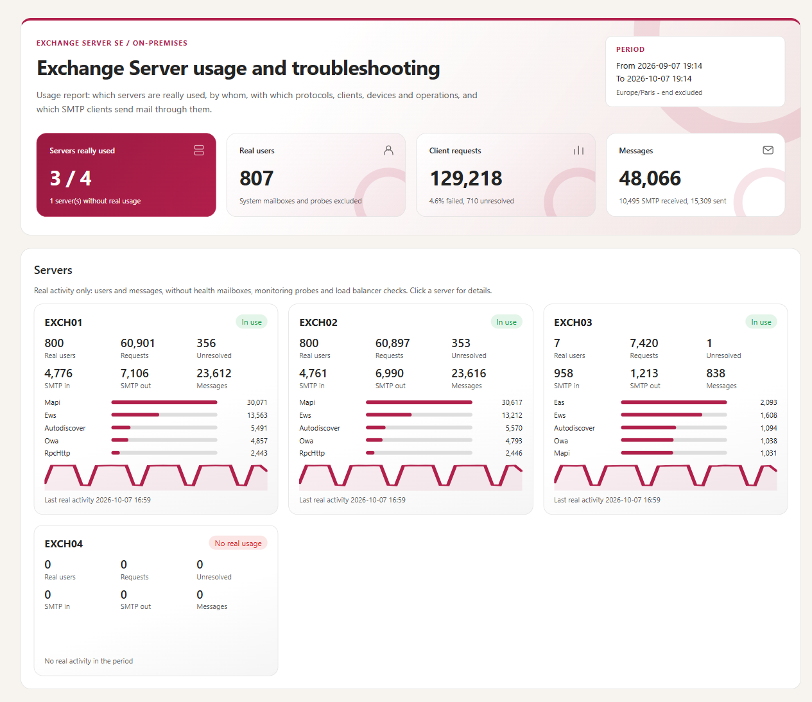

# Exchange Log Report — User guide

> Follow the path, one step after the other. Each step says **what to do**, gives the command to copy, says **what you should see**, and **what to do if not**. How the tool works, every setting and the internals are in the [developer guide](ExchangeLogReport-Guide.md).

> [!IMPORTANT]
> Files downloaded from the Internet may be blocked by Windows and fail to run. Before using this project, unblock every file in the downloaded folder:
>
> ```powershell
> Get-ChildItem "C:\Chemin\Du\Dossier" -Recurse -File -Force | Unblock-File
> ```
>
> Replace the example path with the folder where you downloaded or extracted this project.

<!-- icon: flow -->
## 1. Start here

```path
Set up once | settings | Set up once: then the collection runs by itself every hour
Set up once | 1 | List the servers | write their names in the configuration
Set up once | 2 | Find the log folders | `-Mode Discover`, with your administrator account
Set up once | 3 | Collect every hour | a scheduled task; its first run reads 14 days of logs
Set up once | 4 | Check | `-Mode Status`: every server has data
A | chart | Recurring reporting
A | 5 | Schedule the reports | every morning the last 24 hours, every month the last month
A | 6 | Open the report | the HTML file in the reports folder
A | 7 | Option: by e-mail | the same reports, sent to your team
B | search | Troubleshooting on demand
B | 5 | Run a Detailed report | on the user and the hours of the problem
B | 6 | Open the client session | HTML report, **Client sessions** tab
B | 7 | Follow the timeline | each step: what failed, and where its raw log lines are
```

1. Do steps **1 to 4** once. After that, the tool collects the logs by itself, every hour.
2. Then choose:
   - **A · Recurring reporting** — reports made for you every day and every month: which servers are really used, by whom, and what keeps failing. For the messaging manager, the architects and operations. You can also receive them by e-mail.
   - **B · Troubleshooting** — something went wrong for a user, a message or a server: you run one report and follow what happened. For the Exchange administrators and support.
   - Or both.

**The commands use one example.** Copy them as they are, and only change the names in this table to yours:

| What | In the example | Change to |
|---|---|---|
| The Exchange servers | `EXCH01`, `EXCH02`, `EXCH03`, `EXCH04` | your servers |
| The server where the tool runs | `EXCH01` | one of your Exchange servers (or an administration server: chapter 2) |
| The folder of the tool | `E:\Tools\ExchangeLogReport` | where you copied the tool |
| PowerShell 7 | `E:\Tools\pwsh\pwsh.exe` | where PowerShell 7 is (`C:\Program Files\PowerShell\7\pwsh.exe` once installed) |
| The domain, the users | `contoso.com`, `alice@contoso.com`, `bob@contoso.com` | your domain, your users |
| The day of a problem | `2026-10-07` | the day of your problem |

<!-- icon: checklist -->
## 2. Before you start

```steps
Copy PowerShell 7 | Download the PowerShell 7 zip (7.4 or later) and unzip it into `E:\Tools\pwsh` on EXCH01. Nothing to install.
Copy the tool | Unblock the files (box above), then copy the folder of the tool to `E:\Tools\ExchangeLogReport` on EXCH01.
Check your account | You can sign in to EXCH01 as an administrator, and your account is in the Exchange role group *View-Only Organization Management* (for step 2 only).
```

That is all for a tool that runs on an Exchange server: there, it runs as **SYSTEM**, which can already read the logs of every Exchange server.

### The details

| Item | Requirement |
|---|---|
| Exchange | Exchange Server SE, on-premises. Mailbox servers and Edge Transport servers. |
| PowerShell | **7.4 or later** (`pwsh`) — a portable zip is enough. **Windows PowerShell 5.1** (built into Windows Server) for step 2 only. |
| Account | **Local administrator of every Exchange server** (the logs are read through `\\<server>\C$`). On an Exchange server: **SYSTEM**, nothing to configure. On an administration server: a **domain account** (not a local account), with *Log on as a batch job* on that server. |
| Exchange role | *View-Only Organization Management*, for step 2 only. The collection and the reports need no Exchange role. |
| Network | SMB (445) from the collector to every Exchange server. From an administration server, also HTTP (80) to one Exchange server for step 2. |
| Logging | SMTP: `ProtocolLoggingLevel Verbose` on the connectors to analyse. POP/IMAP: protocol log on (optional). HttpProxy, IIS, MAPI and message tracking are on by default. |
| Edge Transport | Its own copy of the tool **on the Edge itself** (chapter 6). |
| E-mail (option of step 7) | SMTP (25, 587 or 465) from the collector to a receive connector that accepts it. |

> [!WARNING]
> The account that collects is local administrator of the Exchange servers: treat it like an Exchange administrator account. The tool itself only reads: it never changes a setting, and sends nothing unless you turn on the e-mail of step 7.

On an administration server instead of an Exchange server: the commands to create the account, its group and its scheduled task are in the [developer guide, 4.1](ExchangeLogReport-Guide.md#41-where-to-run-it-and-with-which-account) and [chapter 7](ExchangeLogReport-Guide.md#7-scheduled-collection).

<!-- icon: settings -->
## 3. Set up once

On EXCH01, right-click **PowerShell 7** › *Run as administrator* (or run `E:\Tools\pwsh\pwsh.exe` as administrator), then go to the folder of the tool. Keep this window open for all the steps:

```powershell
cd E:\Tools\ExchangeLogReport
```

### 1 · List the servers

**Do:** open the configuration.

```powershell
notepad .\config\ExchangeLogReport.config.psd1
```

Find the `Servers` block. Write the names of your servers, one per line, then save and close Notepad:

```powershell
Servers = @(
    @{ Name = 'EXCH01' }
    @{ Name = 'EXCH02' }
    @{ Name = 'EXCH03' }
    @{ Name = 'EXCH04' }
)
```

**You should see:** nothing yet. The names are enough: step 2 finds the rest.

### 2 · Find the log folders

**Do:** run this **with your own administrator account** (not as SYSTEM: SYSTEM has no Exchange role).

```powershell
.\Invoke-ExchangeLogReport.ps1 -Mode Discover
```

**You should see:** one line per server, then a green **Log paths discovered**.

**If not:** read the yellow lines. *Exchange remote PowerShell could not be opened*: run it on an Exchange server, or add `-ConnectTo EXCH01`. *Folder not readable*: your account is not administrator of that server.

### 3 · Collect every hour

**Do:** copy the whole block. It creates the scheduled task, then starts its first run now:

```powershell
$pwsh = 'E:\Tools\pwsh\pwsh.exe'
$tool = 'E:\Tools\ExchangeLogReport\Invoke-ExchangeLogReport.ps1'
$run  = "$pwsh -NoProfile -ExecutionPolicy Bypass -File $tool"

# Every hour: read the new log lines
schtasks /Create /F /RU SYSTEM /RL HIGHEST /TN "Exchange Log Report - collect" `
    /SC HOURLY /TR "$run -Mode Collect"

# The first run, now
schtasks /Run /TN "Exchange Log Report - collect"
```

**You should see:** `SUCCESS` twice (in the language of Windows).

The first run reads the last 14 days of logs. It is the only long one: about **6 minutes** for two servers on the lab, more with many servers. Then the task runs every hour and reads only the new lines: a few seconds. You never wait for it.

### 4 · Check

**Do:** a few minutes later, run:

```powershell
.\Invoke-ExchangeLogReport.ps1 -Mode Status
```

**You should see:** one line per server and per kind of log, with its dates of data and the noise removed.

**If not:** *No collection in the database yet*: the first run of step 3 is not over — wait a few minutes and run it again. A server without data: its logs are not readable (chapter 8).

**Done.** The tool is ready. Go to **A** (chapter 4), **B** (chapter 5), or both.

<!-- icon: chart -->
## 4. A · Recurring reporting

Two reports are made for you, in the folder `reports`: **every morning** what happened in the last 24 hours, **the 1st of every month** who used which server during the last month. If you want, they can also arrive by e-mail (step 7).

### 5 · Schedule the reports

**Do:** copy the whole block. It creates two scheduled tasks, then makes the daily report now, so that you do not wait until tomorrow:

```powershell
$pwsh = 'E:\Tools\pwsh\pwsh.exe'
$tool = 'E:\Tools\ExchangeLogReport\Invoke-ExchangeLogReport.ps1'
$run  = "$pwsh -NoProfile -ExecutionPolicy Bypass -File $tool"

# Every day at 07:00: what happened in the last 24 hours (Detailed report)
schtasks /Create /F /RU SYSTEM /RL HIGHEST /TN "Exchange Log Report - daily report" `
    /SC DAILY /ST 07:00 /TR "$run -Range Last24Hours -ReportType Detailed"

# The 1st of every month at 07:00: who used which server last month (Usage report)
schtasks /Create /F /RU SYSTEM /RL HIGHEST /TN "Exchange Log Report - monthly report" `
    /SC MONTHLY /D 1 /ST 07:00 /TR "$run -Range PreviousMonth"

# The daily report, now
schtasks /Run /TN "Exchange Log Report - daily report"
```

**You should see:** `SUCCESS` three times (in the language of Windows).

### 6 · Open the report

**Do:** wait one minute, then open the newest report:

```powershell
Get-ChildItem .\reports -Recurse -Filter ExchangeLogs.html |
    Sort-Object LastWriteTime | Select-Object -Last 1 | Invoke-Item
```

**You should see:** the report in your browser. It works offline, and you can send the file to anyone.

Each report is a new folder in `E:\Tools\ExchangeLogReport\reports`: the HTML file, and the same data in CSV files for Excel. Delete the old folders when you no longer need them.

**The monthly report** answers *is this server really used?* with one card per server:



In this example:

- **EXCH04** says *No real usage*: in a whole month, only monitoring probes and load balancer checks reached it.
- **EXCH03** says *In use*, but by 7 users only. Click the **Users** tab and choose EXCH03 in *Servers*: these 7 users, and their old clients — Outlook 2013, RPC over HTTP, an old Android, an EWS application, Internet Explorer. Click the **SMTP clients** tab and choose EXCH03: a scanner still sends mail through it, without TLS.

These are the people to contact before EXCH03 goes. To look at it any day, for the last 30 days:

```powershell
.\Invoke-ExchangeLogReport.ps1 -Range Last30Days -Server EXCH03
```

**The daily report** opens on the same cards for the last 24 hours, with the client sessions, the failed requests and the messages of the day: chapter 5 explains how to read them.

### 7 · Option: receive the reports by e-mail

**Do — 1. Say where to send them.** Open the configuration again:

```powershell
notepad .\config\ExchangeLogReport.config.psd1
```

Find the `Mail` section. Change these lines to your values, then save and close Notepad:

```powershell
Mail = @{
    Enabled        = $false                                 # keep $false: the tasks below say when to send
    SmtpServer     = 'mail.contoso.com'                     # your SMTP name, the one of its certificate
    Port           = 25
    Encryption     = 'StartTls'
    Authentication = 'Anonymous'
    From           = 'exchange-log-report@contoso.com'
    To             = @('messaging-team@contoso.com')
}
```

**Do — 2. Send a test message.**

```powershell
.\Invoke-ExchangeLogReport.ps1 -Mode MailTest
```

**You should see:** a green **Test message sent**, and the message in the mailbox of messaging-team@contoso.com.

**If not:** the conversation with the SMTP server is shown, and the red line says why: name or certificate, port, account. See [Other e-mail settings](#other-e-mail-settings) below.

**Do — 3. Add the e-mail to the two reports.** The same commands as step 5, with `-SendMail` at the end (`/F` replaces the tasks):

```powershell
$pwsh = 'E:\Tools\pwsh\pwsh.exe'
$tool = 'E:\Tools\ExchangeLogReport\Invoke-ExchangeLogReport.ps1'
$run  = "$pwsh -NoProfile -ExecutionPolicy Bypass -File $tool"

schtasks /Create /F /RU SYSTEM /RL HIGHEST /TN "Exchange Log Report - daily report" `
    /SC DAILY /ST 07:00 /TR "$run -Range Last24Hours -ReportType Detailed -SendMail"

schtasks /Create /F /RU SYSTEM /RL HIGHEST /TN "Exchange Log Report - monthly report" `
    /SC MONTHLY /D 1 /ST 07:00 /TR "$run -Range PreviousMonth -SendMail"
```

**You should see:** `SUCCESS` twice (in the language of Windows). The reports are still written in the `reports` folder; they are also sent. The daily e-mail lists the **main problems** in its body — users with unresolved failures, client sessions that failed, SMTP clients with refused mail — so that it can be read without opening the report:


### Other e-mail settings

| Authentication | When | In the `Mail` section |
|---|---|---|
| `Anonymous` | A receive connector that accepts the collector by its address (the example above, or a relay connector). | Nothing else. |
| `Basic` | An account and its password, sent only over TLS. | `Port = 587`. Save the account once, **as the account of the tasks**: `-Mode MailTest -Credential (Get-Credential 'CONTOSO\svc-elr-mail')`. |
| `Kerberos` | No password sent. On Exchange: port 587 (*Client Frontend*), with an account **that has a mailbox**: SYSTEM is refused (*Unable to proxy authenticated session*). | `Port = 587`, and save the account as for Basic. |

The saved account is protected by DPAPI: only the Windows account that saved it can read it, on this computer. A self-signed certificate: set `CertificateThumbprint`. Every value: [developer guide, 8.1](ExchangeLogReport-Guide.md#81-sending-the-report-by-e-mail).

<!-- icon: search -->
## 5. B · Troubleshooting

*Alice says: "This morning, Outlook and my phone kept failing."* Three steps, a few minutes.

### 5 · Run a Detailed report on the user and the hours

**Do:** copy the command. Change only the day, the hours and the user:

```powershell
.\Invoke-ExchangeLogReport.ps1 -Start '2026-10-07 08:00' -End '2026-10-07 12:00' `
    -ReportType Detailed -User alice@contoso.com
```

**You should see:** at the end, a green **Report ready**, and the line **Open** with the path of the HTML file. It takes from a few seconds to a few minutes.

**If not:** *No collection in the database yet*: do steps 1 to 4 first.

### 6 · Open the client session

**Do:** open the HTML file of the line **Open** (Ctrl + click on it, or copy the path into the browser). Click the **Client sessions** tab. Click the row of Alice whose outcome is *Failed*.

**You should see:** one row per Outlook, phone, OWA, EWS, IMAP or POP session of Alice, with its outcome: *OK*, *Recovered* (it failed, then worked again), *Intermittent errors*, *Failed*.

### 7 · Follow the timeline

**You should see:** the timeline of the session — every request, in order, from the front-end server to the back-end server:


A red dot is a failure. Read its line: the HTTP status, and the real result hidden behind an HTTP 200 in the back end (MAPI status, `DeviceNotProvisioned`, `UserDisabledForSync`). **Do:** click it. It shows everything kept for that request, and the command that finds its **raw lines** in the Exchange logs — click **Copy**, paste it in PowerShell:


### Other cases

Same three steps. Only the command of step 5 and the tab of step 6 change.

**Bob did not receive a message**

```powershell
.\Invoke-ExchangeLogReport.ps1 -Range Last24Hours -ReportType Detailed -User bob@contoso.com
```

Tab **Messages**: each message with its status per recipient. Click it: its route through every server, and the SMTP conversations. Mail refused during the SMTP conversation (relay denied, unknown recipient) says *Rejected (SMTP)*.

**Many users failed on EXCH01 and EXCH02 yesterday afternoon**

```powershell
.\Invoke-ExchangeLogReport.ps1 -Start '2026-10-06 14:00' -End '2026-10-06 15:30' `
    -ReportType Detailed -Server EXCH01, EXCH02
```

Tab **Failed and slow requests**: all the users of one server failing at the same time is a server incident. *Recovered*: the same user worked again afterwards. *Unresolved*: the problem stayed.

**Alice and Bob, the whole day**

```powershell
.\Invoke-ExchangeLogReport.ps1 -Date 2026-10-07 -ReportType Detailed -User alice, bob
```

Tab **Client sessions**, then tab **Messages**.

The details stay **14 days** in the database (client sessions, failed requests, SMTP conversations), the usage **60 days**: a Detailed report on an older day has less detail.
<!-- icon: refresh -->
## 6. Keep it running

### Is the collection working?

```powershell
# What the database contains, per server and source: dates of the data, last read, noise removed
.\Invoke-ExchangeLogReport.ps1 -Mode Status

# Last result of the scheduled tasks: 0 = success, 2 = finished with warnings (or e-mail not sent), 1 = failure
Get-ScheduledTask -TaskName 'Exchange Log Report*' | Get-ScheduledTaskInfo | Select-Object TaskName, LastRunTime, LastTaskResult
```

`0xC000015B` (`3221225819`): the account of the task lacks *Log on as a batch job*. A source whose newest data is old has stopped writing, or its logs were moved: run step 2 again.

### The Data line of every report

A report reads the database. The **Data** line under its banner says how fresh the data is, and whether the report reads the new log lines first:

| Data line | What happens |
|---|---|
| `collected until 16:45 (20 min ago)` | The hourly collection runs normally: the report reads the database. |
| `… the period is complete` | The period ends before the last collection (`PreviousMonth`, a past incident): the report reads the database, whatever the age of the data. |
| `… more than 90 min …: the new log lines are read first` | The last collection is older than 90 minutes (`Report.MaxDataAgeMinutes`): the report first reads the lines written since. **Check the task of step 3.** |
| `… a collection is running …` | The report does not wait: it uses the data already collected. |
| `No collection in the database yet` (error) | Step 3 has not run yet. A report never starts the first collection on its own. |

Add `-Collect` to read the new lines first whatever the age of the data, `-NoCollect` to never read them.

### After a CU, a new server or a moved log folder

Add a new server to the `Servers` block (step 1), then run step 2 again with your administrator account and read its warnings:

```powershell
.\Invoke-ExchangeLogReport.ps1 -Mode Discover
```

### Edge Transport server

On the Edge itself, its own copy of the tool and the same steps 1 to 4, run as a local administrator or SYSTEM (on an Edge, step 2 accepts both). The report is an **Edge report**: messages through the Edge, **SMTP clients** (who sends to the Edge) and **SMTP destinations** (Exchange Online, the MX of the internet domains, the mailbox servers).

```powershell
.\Invoke-ExchangeLogReport.ps1 -Range Last7Days -ReportType Detailed
```

<!-- icon: calendar -->
## 7. Change the examples

The commands above fix one example. Everything in them can be changed:

| To change | Write | Example |
|---|---|---|
| The period | `-Range Last24Hours`, `Last7Days`, `Last30Days`, `PreviousMonth` | `-Range Last30Days` |
| | `-Date` one day | `-Date 2026-10-04` |
| | `-Month` one month | `-Month 2026-09` |
| | `-Start` / `-End`: start included, end excluded; an end later than now is replaced by now | `-Start '2026-10-05 08:00' -End '2026-10-05 12:00'` |
| The type | `-ReportType Usage` (who uses which server) or `Detailed` (+ client sessions, failed and slow requests, messages) | `-ReportType Detailed` |
| The users | `-User`: any part of the account (`domain\sam`), UPN or SMTP address; several separated by commas | `-User alice, bob@contoso.com` |
| The servers | `-Server`: one or more servers of the configuration | `-Server EXCH01, EXCH02` |
| The freshness | `-Collect` (read the new log lines first) or `-NoCollect` (never) | `-Collect` |
| The folder of the report | `-OutputPath` | `-OutputPath D:\Reports` |
| The e-mail | `-SendMail` (send this report), `-SendMail:$false` (do not) | `-SendMail` |

> [!NOTE]
> **No parameter is ignored silently.**
> - `-Date`, `-Month` and `-Start` / `-End` select their period on their own: `-Range` is not needed.
> - `-Start` needs `-End`, and `-Date`, `-Month` and `-Start` / `-End` cannot be combined.
> - A period that contradicts `-Range` (`-Range Last7Days -Start …`) is an error: nothing runs.
> - A parameter that the mode does not use (a period with `-Mode Collect` or `-Mode Status`, for example) is shown in yellow under the banner, with the reason, and the command runs anyway.
<!-- icon: file -->
## 8. Results

Each report is written to a new folder under `reports\`, one per run, named after the report type, the period and the time (`ExchangeLogs_Detailed_…`). The console shows it at the end:

- **`<prefix>.html`** — the report: self-contained, it can be sent by mail or opened without internet access. Search, filters, sortable columns, *Export view to CSV*; click a row for its details.
- **`<prefix>-<view>.csv`** — the same data (Servers, Users, Messages...), always complete: separator `;`, opens directly in Excel.

| Exit code | Meaning |
|---|---|
| `0` | Success. |
| `2` | Finished with warnings: a server, a folder or a file could not be read, a source is stale, the IIS log folders changed since `-Mode Discover`, or the report could not be sent by e-mail (or a recipient was refused). The run went to the end: a report run still writes its report. |
| `1` | Failure: read the error in red, and the log file of the day in `logs\`. |

| Warning | What to do |
|---|---|
| *folder not found or not readable* | The account is not local administrator of that server, or the logs were moved: run `-Mode Discover`. |
| *SMTP protocol logging is off on …* (`-Mode Discover`) | That SMTP traffic is not in the reports: set `ProtocolLoggingLevel Verbose` on the connector if it matters. |
| *No log line newer than 24 h for …* / *Logging stopped, or the logs were moved* | The collection or the logging stopped, or the old folder is read: check the scheduled task, then run `-Mode Discover`. |
| *The paths file was written on …* | The tool folder was copied from another computer: run `-Mode Discover` on this one. |
| *No collection in the database yet* | Run `-Mode Collect` once (it reads the last 14 days), then schedule it every hour (step 3). |
| *… more than 90 min (Report.MaxDataAgeMinutes) …* at every report | The hourly collection is not running: check the scheduled task (chapter 6). |
| *The report was not sent by e-mail* | The reason follows (server not reachable, certificate not trusted, account refused, STARTTLS not offered). Run `-Mode MailTest` with the account of the task: it shows the SMTP conversation. |

Anything else: [developer guide, Annex A — Troubleshooting](ExchangeLogReport-Guide.md#annex-a--troubleshooting).
